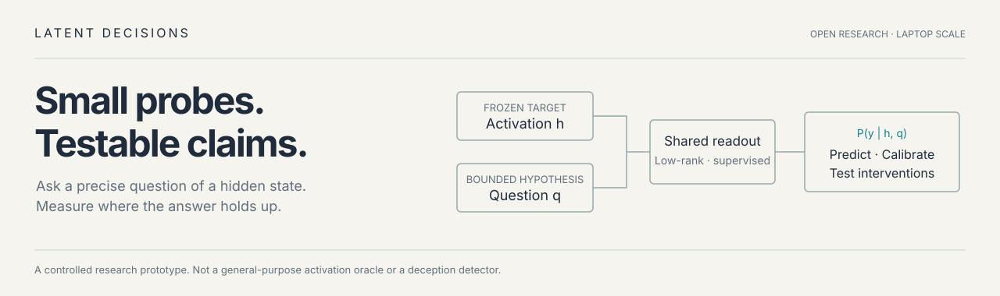
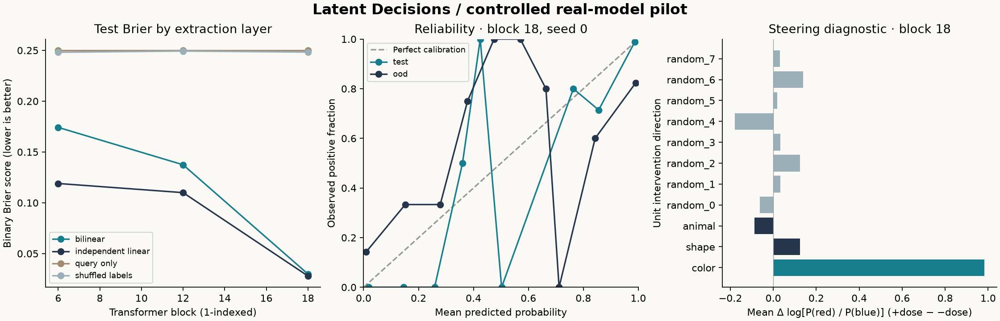

<p align="center"></p>

# Latent Decisions

**Can a tiny question-conditioned probe read a language model's activations reliably—and tell us something about what drives its behavior?**

Latent Decisions is a working, laptop-scale research prototype. It pairs a frozen
language model with a small probabilistic readout, evaluates calibration and transfer,
and tests interventions on the original model. The code and a completed local pilot
are included. **There is no demonstrated advantage over independent linear probes yet.**

[Results](results/pilot/README.md) · [Research plan](docs/research-plan.md) ·
[Prior art](docs/prior-art.md) · [Protocol](docs/protocol.md) · [24 GB compute guide](docs/compute.md)

## Latest research update — 24 September 2026

The [follow-up studies](results/followup/README.md) add two model sizes, answer-remapping
controls, unlabeled score correction and four fresh prompt formats. The causal task
failed its competence checks; an initially promising correction did not pass the
fresh-format continuation criterion on both models. These results narrow the project
and are included with the positive findings. No LessWrong research-post draft has
been prepared.

The controlled task ladder tested Qwen2.5-1.5B and SmolLM2-1.7B on four sentiment
task structures and two prompt formats. Neither model family cleared the strict
behavior gate, so no probe phase ran. A follow-up found that adding an explicit
one-word constraint restores valid-label output for SmolLM2, but not 90% task accuracy.
That narrow result overlaps established format-following research, so no LessWrong
post is planned. See the [008 results](results/task-ladder-v1/README.md) and
[009 results and prior-work review](results/response-policy-control-v1/README.md).

Experiment 010 tested whether a small readout could forecast prompt-level effects. It
missed its preregistered improvement rule; a model-specific gradient reference
predicted the score changes much better. Experiment 011 then found that, on mixed
reviews, the three aspect directions were aligned and their shared component
reproduced almost all of the positive-minus-negative score increase. Its strict
residual-specificity rule failed on the norm-matched random control in SmolLM2. The
[audited result bundles](results/prompt-effect-forecast-v1/README.md) and
[component-control report](results/shared-residual-steering-v1/README.md) retain both
the failed gates and measured effects.

Experiment 012 passed its frozen test in all six model-by-task comparisons: the shared
component beat a norm-matched random direction on isolated clauses, neutral distractors
and keyed records. It produced mean score changes of about +2.29 to +2.32 on Qwen and
+1.38 to +1.46 on SmolLM2, while native task-direction effects were nearly identical
and target selectivity remained small. This is a promising cross-context pattern in
candidate-token scores, not evidence of generative behavior. The
[012 bundle](results/cross-task-shared-shift-v1/README.md) includes all outcomes and
audits.

Experiment 013 tested the same intervention after swapping which meaning A and B
represented. Qwen kept 100% unsteered accuracy under both mappings, yet its steering
effect followed the fixed A token and reversed semantic polarity when the mapping
changed. SmolLM2 showed a similar identifier preference, but its reversed-map baseline
accuracy was only 87.5%, below the frozen gate. This agrees with direct prior work on
cross-encoding steering; it is a careful small-model replication, not a new field
finding. See the [013 results](results/answer-encoding-control-v1/README.md).

Experiment 014 carried the frozen directions onto the SemEval-2014 restaurant gold test
set. On 233 aspect queries from 112 sentences with multiple labeled categories, the
unsteered models were accurate (94.8% Qwen, 92.3% SmolLM2), and the directions still
produced large positive-minus-negative shifts (+2.28 and +1.38 logits). But the
within-sentence aspect-selectivity contrast was −0.0011 logits for Qwen (95% interval
[−0.0032, +0.0014]) and +0.00070 for SmolLM2 ([+0.00051, +0.00087]). The latter is
tiny next to its generic shift. Only eight included sentences had opposing food,
service or price labels, so that conflict slice remains descriptive. The benchmark is
76% positive-labeled; positive steering raises aggregate accuracy slightly while
reducing accuracy on negative cases. See the [014 results and audit](results/natural-aspect-selectivity-v1/README.md).

Experiment 015 used MAMS, a benchmark designed with multiple aspects and differing
polarities in the same review. Across 35 eligible test sentences, 71 queries and 18
conflict sentences, the frozen directions produced a positive target-matched residual
in both models: +0.00903 logits for Qwen and +0.00113 for SmolLM2, both above zero under
sentence bootstrap. Yet these were only 0.38% and 0.08% of the generic sentiment shift,
far below the prespecified 5% practical threshold. Experiment 016 tested five doses
(1.25%–20%) on the same held-out sentences. The specificity fraction fell with dose in
both models (bootstrap slope CI entirely below zero), and no dose met the practical
threshold. At 20%, SmolLM2 strict answer accuracy fell from 73.2% to 54.9%. See the
[015 result bundle](results/mams-aspect-selectivity-v1/README.md) and
[016 dose-response bundle](results/mams-dose-response-v1/README.md).

Experiment 017 compared layers 8, 16 and 24 at a dose matched to each layer's training
activation norm. No layer reached 5% specificity. SmolLM2 nevertheless showed a sharp
layer dependence: its layer-16 residual was 0.01016 logits (1.38% of the generic shift),
versus 0.00113 (0.08%) at layer 24. A post-hoc paired difference was +0.00903 logits
(95% CI [+0.00722, +0.01094]) on all 35 reviews and +0.01013 on the 18 conflict reviews.
The paired specificity-fraction difference was +1.30 percentage points for SmolLM2
(95% CI [+1.07, +1.52]) and +1.33 points for Qwen ([-1.85, +5.31]). This is a candidate
model-specific localization signal, not a replicated layer effect: the comparison was
post-hoc, uses one benchmark and does not clear the practical threshold. See the
[017 audit and all-layer results](results/mams-layer-selectivity-v1/README.md).

The MAMS result is a small, consistent score-level residual paired with a clear
failure of useful selectivity: stronger intervention mostly amplifies generic valence
and eventually damages answers; the layer sweep gives a potentially interesting,
model-specific wrinkle. Still, 35 sentences in one dataset and two small instruction
models do not establish a general mechanism or field-level result. **LessWrong decision:
not yet.** The next test should lock layer 16 before outcomes and evaluate it on an
independent benchmark with more within-review polarity conflicts, keeping every prompt,
control and model result. The aim is a reliable empirical contribution, not a funding
pitch.

## What has actually run

A frozen **Qwen2.5-0.5B-Instruct** model on an **Apple M5 MacBook Air with 24 GB RAM**:
416 controlled prompts, three activation layers, three probe training seeds, and no
paid compute. The rank-four query-conditioned head has **8,065 trainable parameters**.

- **About 95% held-out accuracy**, with ordinary linear probes slightly better.
- **About 79% on a new prompt template**: a visible transfer and calibration failure.
- **Near chance after shuffling activations or swapping questions**, supporting
  dependence on both inputs.
- **A larger red/blue steering effect for the color direction than the eight sampled
  random directions**, an exploratory behavioral-specificity signal.

The task reads three explicit instruction settings. A full-prompt text baseline solves
it. It does **not** establish hidden-intent detection, unseen-property generalization,
or a uniquely identified mechanism. See the [complete results and limitations](results/pilot/README.md).



## Why this project exists

The inspiration was Jev's structured probabilistic decision interface. This repository
is **not Jev, not an RLCD implementation, and not affiliated with TypeSafe**.

Natural-language activation queries already exist in
[LatentQA](https://arxiv.org/abs/2412.08686) and
[Activation Oracles](https://alignment.anthropic.com/2025/activation-oracles/).
A [2026 paper](https://arxiv.org/abs/2605.26045) already studies oracle confidence,
constrained candidate scoring and calibration. Probability outputs alone are not novel.

Our narrower research question is whether **small shared readouts improve sample
efficiency across properties, under a fixed capacity budget**, and whether their
probabilities and behavioral specificity survive meaningful shifts. That remains
untested here. The [literature review](docs/prior-art.md) explains the overlap; the
[research plan](docs/research-plan.md) states the next experiments and stop criteria.

## Run it locally

Requirements: Python 3.11+, [uv](https://docs.astral.sh/uv/), and a CPU or Apple Silicon
Mac. The pinned environment was tested with Python 3.12. Other GPU adapters are not
included. First use without cached weights downloads the pinned target model.

```bash
uv sync --frozen --extra dev --python 3.12
uv run pytest -q
uv run latent-decisions all --run runs/my-first-pilot
open runs/my-first-pilot/report.html  # macOS; otherwise open this file in a browser
```

Use `--offline` when the model is already cached. No credentials or paid API are
needed. Results directories are preserved: choose a new `--run` for each experiment.

Run each stage separately if preferred:

```bash
uv run latent-decisions collect --offline --run runs/experiment-01
uv run latent-decisions train --run runs/experiment-01
uv run latent-decisions intervene --offline --run runs/experiment-01
uv run latent-decisions report --run runs/experiment-01
uv run python scripts/audit_run.py runs/experiment-01
```

`configs/macbook.toml` pins the target revision, layers, split sizes, rank and seeds.
The report is a standalone local HTML page with interactive layer, evaluation and
calibration selectors. GitHub does not render its HTML as a website: download the
repository and open `results/pilot/report.html`. No server is necessary.

## What the implementation does

```text
Frozen target ── block-output activation h ──┐
                                           ├─ rank-constrained head ── P(setting | h, q)
Frozen question encoder ── query vector q ──┘
                                                       │
                          held-out scores + calibration + interventions on target
```

For a fixed query, the head is affine in the activation. The implementation includes:

- Fully crossed factors and scenario-level train/validation/calibration/test separation.
- Independent linear, query-only, shuffled-label and privileged text baselines.
- Paraphrase, shuffled-activation, swapped-query and mean-activation diagnostics.
- Raw and temperature-scaled Brier, NLL, ECE, AUROC and per-property scores.
- Fixed-dose target interventions, zero sham, random directions, vocabulary KL and token mass.
- Saved predictions, configuration and data hashes, source fingerprint, and an artifact audit.

Temperature scaling uses calibration data only. Layer selection uses validation only.
Tests cover split isolation, proper-score edge cases, query-dependent signal recovery,
activation-gradient scaling, padding, final-token logits and intervention hooks.

## Repository map

```text
configs/macbook.toml       Small-model experiment, pinned revision
src/latent_decisions/     Data, capture, probes, evaluation, interventions, report
scripts/audit_run.py      Recompute reported metrics from per-example predictions
tests/                   Scientific and adapter correctness tests; no downloads
docs/prior-art.md        Primary-source review and limits of novelty
docs/protocol.md         Labels, splits, estimands and known limitations
docs/research-plan.md    Eight-week plan, continuation gates and failure conditions
docs/funding-brief.md    Seed-funding proposal with an illustrative budget
docs/compute.md          Measured pilot and practical 24 GB memory constraints
results/pilot/           Reviewable results, data, manifests and offline report
```

## Contributing

We welcome careful reproductions, harder property families, matched-budget baselines
and negative results. See [CONTRIBUTING.md](CONTRIBUTING.md). The research plan
prioritizes frozen comparisons, complete negative results, and laptop-sized experiments
that can be independently checked.

MIT-licensed code. Model weights retain their upstream license. Citation metadata is
in [CITATION.cff](CITATION.cff).
