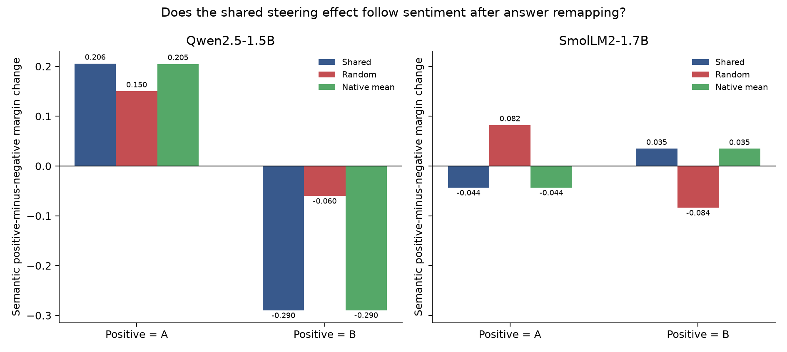

# Answer-encoding control (experiment 013)

## Frozen rule

Interpret mapped changes semantically only if unsteered next-token accuracy reaches 90% in both encodings. Mapping-robust semantic steering requires the shared component to beat a norm-matched random direction in both answer mappings for both models, with group-bootstrap 95% intervals above zero.

## Results

**qwen-1.5b**
- positive_is_A: unsteered next-token accuracy 100.0%; A/B validity 100.0%; shared semantic-margin change +0.2058, random-adjusted +0.0554, 95% CI [+0.0427, +0.0682]; shared A−B identifier-margin change +0.2058.
- positive_is_B: unsteered next-token accuracy 100.0%; A/B validity 100.0%; shared semantic-margin change -0.2899, random-adjusted -0.2297, 95% CI [-0.2525, -0.2070]; shared A−B identifier-margin change +0.2899.
**smollm2-1.7b**
- positive_is_A: unsteered next-token accuracy 100.0%; A/B validity 100.0%; shared semantic-margin change -0.0437, random-adjusted -0.1259, 95% CI [-0.1269, -0.1250]; shared A−B identifier-margin change -0.0437.
- positive_is_B: unsteered next-token accuracy 87.5%; A/B validity 100.0%; shared semantic-margin change +0.0349, random-adjusted +0.1188, 95% CI [+0.1183, +0.1194]; shared A−B identifier-margin change -0.0349.

**The full semantic-mapping rule did not pass.**

Qwen is the clean result: unsteered next-token accuracy is 100% under both mappings, but the shared intervention moves the fixed A-minus-B margin toward A in both. Once the meaning of A flips, the semantic positive-minus-negative effect changes from +0.206 to −0.290. That is identifier following in this task, despite perfect baseline task accuracy. SmolLM2's A-minus-B effect consistently favors B, but its reversed-mapping baseline accuracy is 87.5%, below the frozen 90% competence gate, so its semantic interpretation remains unresolved.



Semantic margins are oriented positive-minus-negative under the current mapping. A semantic effect should remain positive when A and B swap meanings. If the semantic effect reverses while the A-minus-B effect retains its sign, the intervention follows an answer identifier. The full per-mapping results retain both orientations.

This is a small-model replication/control of an issue already studied directly by Gao et al. ([Cross-Encoding Steering Evaluation](https://arxiv.org/html/2608.22985v1)). It uses 144 simple synthetic prompts and a next-token score; it does not establish generative behavior or a new method. It is a useful warning against reading a positive-label logit change as semantic sentiment control. Protocol: [`013-answer-encoding-control.md`](../../docs/experiments/013-answer-encoding-control.md).

Reproduce the analysis and package from local captures:

```bash
uv run python scripts/answer_encoding_control.py analyze --root runs/answer-encoding-control-v1
uv run python scripts/package_answer_encoding_control.py \
  runs/answer-encoding-control-v1 results/answer-encoding-control-v1
```

The gzip files contain all baseline and intervention rows. The audit checks outcome, code, protocol and source hashes plus mapping/condition balance. `SHA256SUMS` covers the bundle.
