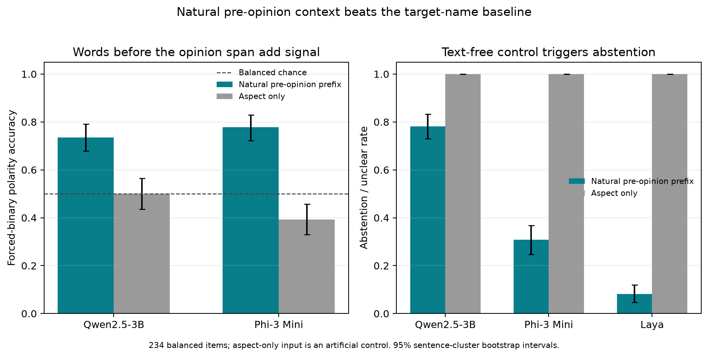

# Experiment 038: natural context versus aspect-only priors

This exploratory, preregistered follow-up asked whether the natural words before
an annotated opinion phrase add polarity signal beyond simply naming the target
aspect. They do on this sample. Forced-binary accuracy was **73.5%** for Qwen and
**77.8%** for Phi on the natural prefixes, versus **50.0%** and **39.3%** when the
same aspect was shown without review text. The paired natural-context gain pooled
across Qwen/Phi was **31.0 percentage points** (sentence-cluster bootstrap 95% CI
**22.2–39.5**). The preregistered diagnostic gate passed.

| Judge | Natural pre-opinion context | Aspect only | Paired context gain |
|---|---:|---:|---:|
| Qwen2.5-3B | 73.5% (95% CI 67.9–79.1) | 50.0% (43.6–56.4) | +23.5 pp (13.2–33.8) |
| Phi-3 Mini | 77.8% (72.2–82.9) | 39.3% (32.9–45.7) | +38.5 pp (29.9–47.0) |

Context gains were positive in each included SemEval subset: +32.8 points on 14lap,
+30.6 on 14res, +33.3 on 15res, and +25.0 on 16res. This shows that target-name
priors alone did not reproduce the natural-prefix accuracy here. It does not
establish whether the added signal is ordinary linguistic context, reconstruction
from the preceding words, or memorized review text.

The no-review control also made behavior consistent across systems: both Qwen and
Phi returned `insufficient` on all 234 aspect-only prompts under the abstention
wrapper, and Laya returned `unclear` on all 234. With natural pre-opinion context,
Qwen abstained 78.2% of the time, Phi 30.8%, and Laya 8.1%. Thus these judges
respond differently to partial review context even though all recognize that no
review text is present in the baseline.



## What this does and does not show

This supports a narrow empirical statement: the visible prefix words carry
predictive information beyond the aspect name for these paired review examples.
The prefix ends before the dataset's sole annotated opinion span, but annotation
visibility is not a complete annotation of every cue a language model could use.
All four source corpora are old enough to be present in web pretraining; benchmark
contamination remains unresolved. Aspect-based sentiment research already studies
spurious correlations, and broad LLM abstention is established work. This is
therefore a research lead, not a claim of a new general abstention effect. A useful
next control is a small text-only classifier trained on three splits and tested on
the fourth; it can check whether the pre-span signal generalizes across these
domains without relying on a large pretrained language model.

The study was selected after Experiment 037, uses the same 234 examples, and is
explicitly exploratory rather than independent replication. The aspect-only
placeholder is an artificial prompt control. The upstream ASTE-Data-V2 repository
does not provide explicit license metadata, so raw review sentences and free-form
generations remain private; this bundle contains IDs, spans, and parsed labels.
All 14 data, pairing, parent-hash, and text-release checks passed in
[`audit.json`](audit.json).

## Reproduction

See the [frozen protocol](../../docs/experiments/038-aspect-only-prior-control.md)
and the matching
[Experiment 037 source data and identifiers](../natural-opinion-span-abstention-v1/README.md).
With the four source files in ignored `.context/aste14res/`, run:

```bash
python scripts/run_aspect_only_prior_control_038.py
python scripts/analyze_aspect_only_prior_control_038.py
python scripts/plot_aspect_only_prior_control_038.py
```

The portable files are [`stimuli.json`](stimuli.json),
[`predictions.json`](predictions.json), [`manifest.json`](manifest.json),
[`analysis.json`](analysis.json), [`audit.json`](audit.json), and
[`SHA256SUMS`](SHA256SUMS). The raw opinion/review text is not included.

## Literature

- [Xu et al. (2020), *Position-Aware Tagging for Aspect Sentiment Triplet Extraction*](https://arxiv.org/abs/2010.02609) supplies the target/opinion/sentiment task and span annotations.
- [Wang et al. (2023), *Reducing Spurious Correlations in Aspect-based Sentiment Analysis with Explanation from Large Language Models*](https://aclanthology.org/2023.findings-emnlp.193/) makes clear that sentiment shortcuts are a known concern.
- [Xu et al. (2024), *Benchmark Data Contamination of Large Language Models: A Survey*](https://arxiv.org/abs/2406.04244) reviews why old benchmark text can complicate evaluation.
