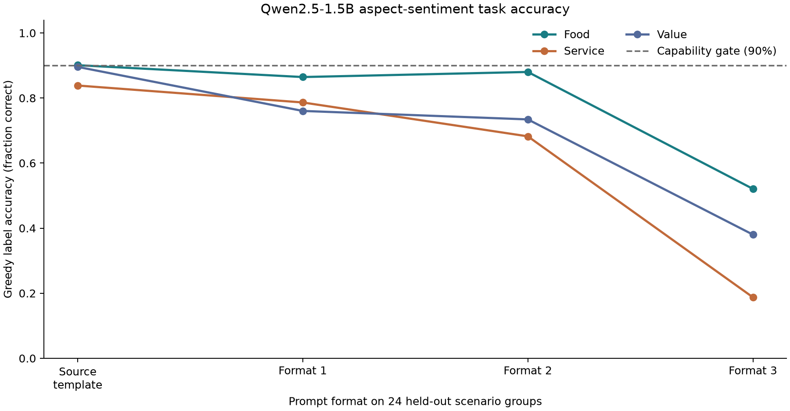

# Aspect sentiment capability study: stopped at the behavior gate

**Run on 23 September 2026, using Qwen2.5-1.5B-Instruct on the MacBook Air.**
The target completed 4,032 prompts across 32 training, 8 validation, 8 calibration,
24 source-test and 24 shifted-format scenario groups. The three sentiment fields
(food, service and value) and eight label combinations were crossed within every
group. Three new formats were reserved for shifted evaluation.

**The prespecified capability gate failed, so no probes were fitted.** On the
source-format test prompts, target greedy-label accuracy was:

| Asked aspect | Accuracy | Required |
| --- | ---: | ---: |
| Food | 90.6% | 90% |
| Service | 81.8% | 90% |
| Value | 91.1% | 90% |



This is a capability result, not a failed probe result. It would be misleading to
report calibration or readout quality from a task the target does not reliably
perform. The complete target outputs and labels are in `qwen-1.5b/dataset.json.gz`;
the 69 MB activation cache is intentionally excluded. `qwen-1.5b/audit.json`
recomputes the gate and validates the balanced groups and label-to-review mapping.

The follow-up diagnostic explains why the benchmark looked promising at first:
the same 1.5B model reached 100% generated-label accuracy on 16 simple sentiment
reviews under each of four phrasings. It then fell to 81.8% when asked about service
inside a mixed three-aspect review. Prompt format also mattered sharply: across
the three shifted formats, aspect accuracy ranged from 18.8% to 88.0%; the third
format was especially poor. These are target behavior measurements, not probe
measurements.

The error pattern suggests a useful next question: when an aspect question and the
overall review sentiment disagree, does the model answer the requested aspect or
the overall impression? This comparison was **not** a primary endpoint in protocol
007 and is exploratory. The current run does not establish that explanation. A
follow-up should vary the number and order of aspects, paraphrase sentiment cues,
and include a second independently trained model family before making that claim.

No LessWrong post is warranted from this run: its central probe study never passed
the target behavior gate. The result does reinforce the practical lesson that target
competence must be checked separately for every queried field and prompt format.

Protocol: [`docs/experiments/007-aspect-sentiment-readout.md`](../../docs/experiments/007-aspect-sentiment-readout.md).
The candidate tasks and earlier capability checks are described in
[`docs/experiments/005-capability-diagnostic.md`](../../docs/experiments/005-capability-diagnostic.md)
and [`docs/experiments/006-standard-sentiment-capability.md`](../../docs/experiments/006-standard-sentiment-capability.md).

Recreate this compact output bundle from the ignored local run directory with:

```bash
uv run python scripts/package_aspect_capability.py \
  runs/aspect-sentiment-v2/qwen-1.5b results/aspect-sentiment-v2
```
