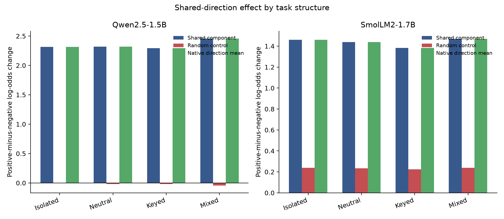

# Cross-task shared-score shift (experiment 012)

## Frozen decision rule

Transfer beyond mixed reviews requires the shared component to exceed a norm-matched random direction with paired 24-group bootstrap 95% intervals entirely above zero in all three other task structures for both model families. All six comparisons are required. The mixed-review result is descriptive because it was already examined in 010–011.

## Results

**qwen-1.5b**
- mixed_review: shared +2.4578, random -0.0434, native mean +2.4580; shared−random 95% CI [+2.4901, +2.5134].
- isolated_clause: shared +2.3176, random -0.0055, native mean +2.3175; shared−random 95% CI [+2.3142, +2.3328].
- neutral_distractors: shared +2.3207, random -0.0201, native mean +2.3205; shared−random 95% CI [+2.3294, +2.3529].
- keyed_record: shared +2.2936, random -0.0164, native mean +2.2936; shared−random 95% CI [+2.2813, +2.3428].
**smollm2-1.7b**
- mixed_review: shared +1.4692, random +0.2381, native mean +1.4691; shared−random 95% CI [+1.2252, +1.2371].
- isolated_clause: shared +1.4597, random +0.2393, native mean +1.4597; shared−random 95% CI [+1.2181, +1.2226].
- neutral_distractors: shared +1.4386, random +0.2347, native mean +1.4386; shared−random 95% CI [+1.2021, +1.2057].
- keyed_record: shared +1.3840, random +0.2236, native mean +1.3840; shared−random 95% CI [+1.1556, +1.1654].

**The frozen all-six rule passed.**



This measures finite positive-minus-negative next-token log-odds changes on synthetic prompts. It does not measure generated behavior or prove that the model uses a general sentiment mechanism. The study reuses the 008 task ladder and its final-test group construction; it is a held-out-structure extension, not an independent replication. A pass warrants follow-up on natural ABSA examples and remapped output tokens, not a broad control claim.

The two manifests record different repository commits because the result-packaging script was committed between the sequential Qwen and SmolLM2 captures. The frozen experiment runner and protocol hashes are identical and pass the audit for both captures.

The closest literature includes behavior-level side-effect prediction and intervention-encoding sensitivity ([Ong et al. 2026](https://arxiv.org/html/2608.11227v1); [Gao et al. 2026](https://arxiv.org/html/2608.22985v1)). This local experiment evaluates a small-model task-structure transfer question. Protocol: [`012-cross-task-shared-shift.md`](../../docs/experiments/012-cross-task-shared-shift.md).

Reproduce analysis and packaging from local captures:

```bash
uv run python scripts/cross_task_shared_shift.py analyze --root runs/cross-task-shared-shift-v1
uv run python scripts/package_cross_task_shared_shift.py \
  runs/cross-task-shared-shift-v1 results/cross-task-shared-shift-v1
```

The gzip archives preserve per-prompt outcomes; activations are excluded. The audit checks hashes, row counts, task balance and frozen protocol provenance. `SHA256SUMS` covers the bundle.
