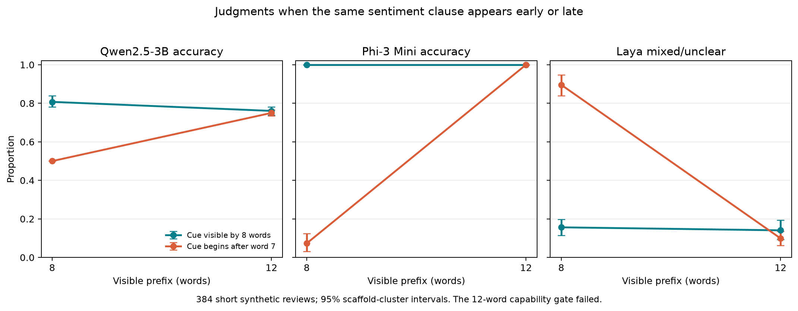

# Experiment 035 — controlled cue-position and polarity

This preregistered test evaluates 384 short, deterministic restaurant-review
sentences with Laya, Qwen2.5-3B and Phi-3 Mini at 8- and 12-word prefixes. The
same seven-word neutral frame and polarity clause appear in both conditions;
only their order changes. The factorial balances positive and negative intended
labels and crosses direct versus negated wording. There are 48 frame × aspect
clusters and 2,304 judge outcomes.

## Preregistered result and gate

The frozen primary difference-in-differences was **+61.2 percentage points**
(late-prefix 8→12 accuracy change minus early-prefix 8→12 change; scaffold-cluster
95% interval **+58.6 to +63.5 pp**). By binary judge, it was +29.7 pp for Qwen
(+26.6 to +33.3) and +92.7 pp for Phi (+87.5 to +96.9).

**The preregistered capability gate failed**, so this primary contrast is
descriptive, not confirmatory: pooled binary accuracy at 12 words was 87.8%,
below the 90% rule; early-position accuracy at 8 words was 90.4%, passing its
85% rule. The large point estimate cannot override the frozen failure rule.

The failure is diagnostic. Qwen was nearly perfect on the direct good/bad cases
and on “not good”, but at 12 words labeled the positive “not bad” construction
positive in only 4 of 96 such judgments. Laya called that phrase clearly positive
in about 56–60% of cases and mixed in most of the rest; Phi labeled it positive
in all tested cases. This disagreement makes “not bad” a poor unambiguous binary
gold condition. Its inclusion drove down the pooled 12-word gate.

## Identical no-cue prefixes

At the late 8-word checkpoint, each frame × aspect prefix is identical across
the four hidden polarity/form continuations. Qwen and Phi were invariant across
those repeated inputs. Qwen returned negative on 44/48 unique prefixes and
positive on 4/48. Phi returned a non-parseable response on 41/48 and negative on
7/48; its parse coverage there was only 14.6%. Laya's randomized answer-key
mapping differed across stimulus IDs despite identical visible prefixes, and
its decoded decision varied on 30/48 repeated contexts. This means the Laya
no-cue profile needs a fixed mapping per identical input before it can be read
as a stable abstention rate.

For Laya, the raw mixed/unclear share was 89.6% on late 8-word prefixes and 9.9%
on late 12-word prefixes. Early prefixes were 15.6% and 14.1%. Treat these as
descriptive because the same-text mapping issue affected repeated no-cue items.
The Qwen/Phi primary remains the preregistered binary-wrapper analysis, with
parse failures counted as incorrect.

## Interpretation and next question

This run demonstrates that prefix position can strongly alter small judges'
outputs on controlled text, but the capability gate failure and “not bad”
ambiguity block a confirmatory claim about cue timing. The identical no-cue
prefixes also expose a practical weakness in forced binary evaluation: one judge
defaults to a polarity and another frequently fails the one-word format when no
polarity is visible. The next preregistered test will use only the clear direct
and “not good” items and give Qwen/Phi an explicit `insufficient evidence`
option. It will test whether the evaluator can abstain on the exact same
truncated text instead of guessing or breaking format. Laya's key map will be
held constant across identical visible inputs.

This result does not yet merit a LessWrong post. The strongest contrast is from
synthetic text; the binary capability gate failed; and natural generated-answer
semantics still lack human validation.

## Reproduction and limitations

- Protocol and exact frozen stimuli: [`035-cue-position-polarity.md`](../../docs/experiments/035-cue-position-polarity.md) and [`035-cue-position-stimuli.json`](../../docs/experiments/035-cue-position-stimuli.json)
- Numeric analysis: [`analysis.json`](analysis.json)
- Label-only outcomes: [`predictions.json`](predictions.json)
- Exact synthetic text: [`stimuli.json`](stimuli.json)
- Provenance and audit: [`manifest.json`](manifest.json), [`audit.json`](audit.json)
- Runner and analysis: `scripts/run_cue_position_polarity_035.py`, `scripts/analyze_cue_position_polarity_035.py`

TripR is not used here; no natural text or generated target answers were involved.
The text is a small templated construction, the fixed judges are not a random
sample of evaluators, “not bad” has pragmatic ambiguity, Phi had poor parse
coverage precisely when its prefix lacked a polarity cue, and Laya's randomized
choice mapping was not fixed across identical hidden-condition variants. See
`analysis.json` for all condition-wise cluster intervals and coverage.
