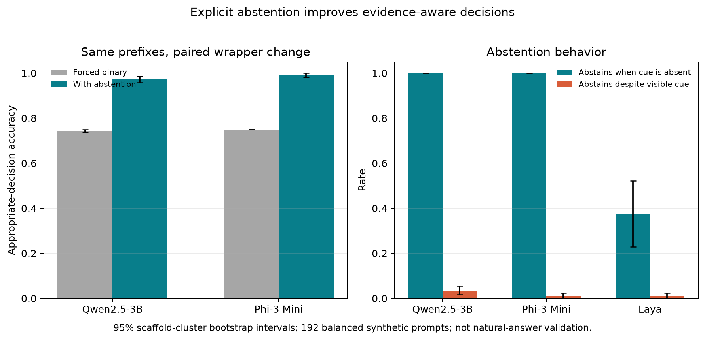

# Experiment 036: explicit abstention for evidence-free prefixes

Offering an `insufficient` response substantially improved decisions when a short
review prefix ended before its sentiment cue. On the matched, constructed set, the
two local generative judges improved appropriate-decision accuracy by **23.6
percentage points** (sentence-scaffold cluster-bootstrap 95% CI **[22.8, 24.3]**).
This is a clean result for a narrow prompt-policy manipulation, not yet a finding
about natural answers or judge reliability in general.

## What was tested

Experiment 036 selected the 192 direct good/bad items (48 frame × aspect scaffolds)
from experiment 035 and reused the exact 8- and 12-word prefixes. A late 8-word
prefix had no sentiment cue and was labeled `insufficient`; all cue-visible prefixes
were expected to receive the source polarity. Qwen2.5-3B and Phi-3 Mini were rerun
with a three-way response option. Their matched forced-binary outcomes came from
experiment 035. Laya was rerun with a deterministic mapping held fixed for identical
visible input. The full factorial produced 1,152 new decisions on local MPS.

## Results

| Judge | Forced binary appropriate | Explicit abstention appropriate | Difference |
|---|---:|---:|---:|
| Qwen2.5-3B | 74.5% | 97.4% | +22.9 pp (95% CI +21.6, +24.2) |
| Phi-3 Mini | 75.0% | 99.2% | +24.2 pp (95% CI +23.2, +25.0) |

Both models abstained on all 96 cue-free late-8 cases. On cue-visible cases, false
abstention was 3.5% for Qwen and 1.0% for Phi. Cue-visible polarity accuracy changed
from 99.3% to 96.5% for Qwen and stayed at 100% to 99.0% for Phi. The frozen success
rule passed: pooled improvement exceeded 5 pp, its interval was above zero, and
neither judge lost more than 5 pp on visible-cue polarity accuracy.

Laya behaved differently: its existing four-way policy mapped to an appropriate
decision on 81.8% overall and returned `unclear` on only 37.5% of the no-cue cases
(cluster-bootstrap 95% CI 22.9–52.1). Its mapping was consistent across the 48 exact
repeated no-cue inputs, so this is not a duplicate-input instability in this run.
This suggests response-set and instruction design matter, but does not isolate which
prompt component caused the gap.

## Interpretation and limits

The paired comparison changes the allowed response set and explicitly instructs the
models to use abstention when evidence is absent. It therefore estimates the effect of
that combined wrapper, not a pure effect of adding one label. The data are short,
deterministically constructed restaurant-review snippets: the “missing evidence”
condition was created by truncation, and the expected decisions follow that design.
There are only two generative judge families and one small decision engine. This does
not validate abstention calibration on open-ended model answers, human judgments, or
distribution shifts.

Evidence sufficiency and abstention are active research topics, including retrieval
and unanswerable-question settings. The next useful question is narrower: does an
explicit abstention option improve judgments on *natural* answer fragments with
human-annotated evidence spans, especially when the answer contains relevant
sentiment evidence that occurs late? That needs an independent benchmark with suitable
evidence annotations; the current result alone does not justify a LessWrong post.

## Reproduction and files

- Frozen protocol: [`036-evidence-aware-abstention.md`](../../docs/experiments/036-evidence-aware-abstention.md)
- Aggregate analysis: [`analysis.json`](analysis.json)
- Audit checks: [`audit.json`](audit.json)
- Stimuli: [`stimuli.json`](stimuli.json)
- Label-only outcomes: [`predictions.json`](predictions.json)
- Model and hash manifest: [`manifest.json`](manifest.json)
- Plot source: [`plot_evidence_aware_abstention_036.py`](../../scripts/plot_evidence_aware_abstention_036.py)

Run the experiment with `python scripts/run_evidence_aware_abstention_036.py`,
analyze using `python scripts/analyze_evidence_aware_abstention_036.py`, and regenerate
the figure with `python scripts/plot_evidence_aware_abstention_036.py`. The private raw
run files are kept under ignored `.context/evidence-aware-abstention-036/`.
