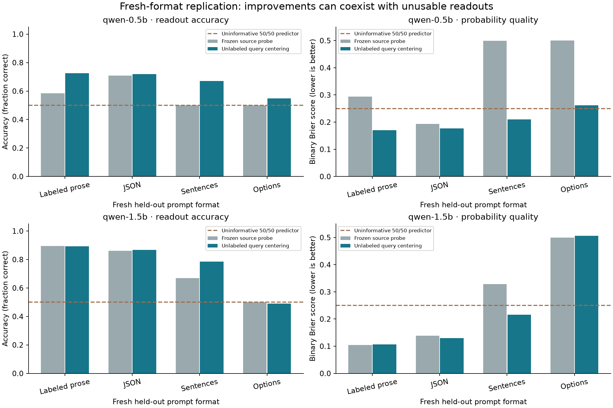

# Follow-up results: a useful diagnosis, not a novel-method claim

**Experiments completed 22–23 September 2026 on the same 24 GB MacBook Air.**
Two frozen Qwen2.5 models (0.5B and 1.5B), **9,216 recorded target prompts**, **72
trained probe configurations**, and **16,128 intervention records**. No paid model
API or cloud compute was used. These counts exclude the original pilot.

**Decision: no LessWrong research-post draft yet.** The answer-remapping experiment
fails its target-competence gate; the initially promising score correction does not
pass its prospective fresh-format continuation criterion on both models. There is
useful evidence here, but not enough for a strong semantic-control or novelty claim.

## What was run

**Experiment 002 — answer remapping and relevance.** Each prompt crosses three binary
settings, the requested field and the A/B answer mapping. Two equal-label-budget
training regimes either fix the mapping or counterbalance it. Both shared bilinear
and independent linear probes are evaluated at three layers and three seeds. Steering
uses the preselected middle layer and seed 0, matched random vectors, a zero sham,
and matched donor activations.

Neither target passes the prespecified requirement of 90% greedy task accuracy in
every field/mapping cell. On ordinary test prompts, 0.5B ranges from **50.0–54.2%**
and 1.5B from **44.8–69.8%**. A probe can decode a setting accurately while the target
fails to apply the requested answer rule. That invalidates a semantic causal
interpretation of this particular task; it does not invalidate the observed readout
measurements. No failing cells were dropped.

The shorthand `output_A` condition predicts the **task-correct output label**, not
the target's actual choice. Under failed competence, it is not a valid control for
an actual answer-writing direction. See [execution notes](../../docs/experiments/002-execution-notes.md).

**Experiment 003 — unlabeled score transport.** We then tested the hypothesis that
some prompt-format failures are shifts of score location. The first six source and
target groups supplied unlabeled anchor scores; the last six target groups supplied
held-out evaluation. Source temperatures and probe weights stayed frozen. Three
query-specific offsets were fitted, without supplying adaptation labels.

At the preselected middle layer, averaged over three seeds and both answer mappings,
the balanced shared probe improved from **57.1% to 84.7% accuracy** on 0.5B and
**56.9% to 74.4%** on 1.5B. Brier fell from **0.3072 to 0.1374** and **0.4029 to
0.2224**, respectively. Within-question/code rank AUROC stayed unchanged: an additive
offset can move thresholds but cannot recover lost ordering information.

These are controlled, balanced distributions. In the explicitly artificial stress
test with 90% positive adaptation prevalence, corrected accuracy fell to **68.3%**
and **65.5%** on the same balanced evaluation population. Labels construct this stress
population; the correction does not get them as supervision. This is not a method
for choosing adaptation weights in practice.

**Experiment 004 — four fresh formats.** Before running any of them, we froze the
seed-0 middle-layer probes and specified a continuation criterion: query centering
must reduce Brier on at least three of four formats for **both** models, with no
remaining degradation greater than 0.05. Each new format has six unlabeled anchor
and six disjoint evaluation groups. All four formats were generated after observing
Experiment 003, so this is a prospective follow-up, not a fully independent study.



The 0.5B model improves Brier on four of four formats. Accuracy changes are:

- Labeled prose: **58.3% → 72.6%**.
- JSON: **70.8% → 71.9%**.
- Sentences: **50.0% → 67.0%**.
- Options: **50.0% → 54.9%**, still worse than an uninformative predictor in Brier
  (**0.2619**, versus **0.25** for a constant 50/50 prediction).

The 1.5B model improves Brier on only two of four formats, failing the criterion:

- Labeled prose: **89.6% → 89.2%**; Brier slightly worsens.
- JSON: **86.1% → 86.8%**; Brier improves slightly.
- Sentences: **67.0% → 78.5%**; Brier improves substantially.
- Options: **50.0% → 49.0%**; Brier worsens from **0.5000 to 0.5067**.

For 1.5B on the options format, mean within-question/code rank AUROC is approximately
**0.511**, versus approximately **0.949** on sentences. Offsets cannot repair the
first kind of failure. This distinction is the most useful diagnosis from the run.

The independent probes remain important controls. For example, the centered 1.5B
independent probe reaches **95.1%** on JSON versus **86.8%** for the shared probe.
That is a descriptive comparison, not a separately selected primary winner or a
cross-benchmark superiority claim. The primary shared-head criterion remains failed.

## Interpretation

There are at least three separate questions to test before interpreting a readout:

1. Can the target perform the task whose computation we want to explain?
2. Does the probe preserve semantic ordering under the new prompt format?
3. If ordering survives, are its threshold and probabilities still appropriate?

The first gate failed in the causal study. The latter two explain why the same cheap
centering correction helps some formats and fails badly on another. A lower Brier
score can also reflect reduced overconfidence while classification remains unusable.

This motivates an evaluation project around **diagnosing types of readout failure**,
not a claim that we have built a superior general-purpose activation oracle. The
three-question checklist is a synthesis of existing concerns, not a novelty claim.

## Literature and scope

[Cross-Encoding Steering Evaluation](https://arxiv.org/html/2608.22985v1) is direct
prior art for the remapping control; [causal-probing reliability](https://arxiv.org/html/2408.15510v3)
and [subspace-patching illusions](https://arxiv.org/abs/2311.17030) cover the broader
control/interpretation gap. [Contextual calibration](https://proceedings.mlr.press/v139/zhao21c.html)
provides longstanding precedent for correcting prompt-dependent answer bias. The
[expanded review](../../docs/prior-art.md) separates those contributions from ours.

Limitations: explicit prompt labels; three known properties; a single model family;
small numbers of scenario clusters; balanced populations; one seed in the fresh-format
study; one intervention dose; and no correction for the many reported comparisons.
The fresh formats also vary surface wording and setting order, so these results do
not isolate a single formatting variable. Training with only the requested property
means irrelevant-field evaluation is itself a relevance shift. Better readout accuracy
does not mean the target uses that information correctly.

A stronger next experiment would use a target/task pair that first passes independent
capability checks, more property families, independently varied label prevalence, and
a second model family. It should compare simple offset correction with supervised
calibration and established contextual-calibration baselines, and test question
ablation explicitly. We have not run that broader study.

## Protocols, artifacts and audit

Prospective local protocol commits:

- `186ba51`: [answer remapping](../../docs/experiments/002-answer-remapping.md).
- `4213336`: [score transport](../../docs/experiments/003-unlabeled-score-transport.md).
- `bc253d9`: [fresh-format replication](../../docs/experiments/004-fresh-template-replication.md).

These are local timestamped specifications, not third-party preregistrations. The
1.5B intervention was resumed after interruption; its timing covers only the resumed
portion. Large activation caches and weights are excluded from this bundle. Datasets
and per-prompt interventions are gzip-compressed; small prediction-score arrays are
included as NPZ files. `SHA256SUMS` covers the measured artifact files.

Validation: **19 tests passed**, **5,760 remapping metric values** reconstructed,
**16,128 intervention records** checked, score-transport results reproduced, and
**1,152 fresh-format metric values** independently checked from saved scores.
These checks establish implementation/artifact consistency, not generalization.

Audit the portable bundle without target weights or new model calls:

```bash
uv run python scripts/audit_followup_bundle.py results/followup
```

Reproduce the model runs (defaults below are immutable: choose unused run directories):

```bash
uv run python -m latent_decisions.relevance all --offline
uv run python scripts/analyze_relevance.py runs/answer-remapping-v1
uv run python scripts/score_transport.py runs/answer-remapping-v1
uv run python scripts/fresh_template_replication.py
uv run python scripts/audit_fresh_templates.py
```

The last script defaults to the already pinned study, including cached model revisions.
For an interrupted intervention, inspect its retained conditions before using
`--resume-interventions`; incomplete conditions are rejected, not silently discarded.
