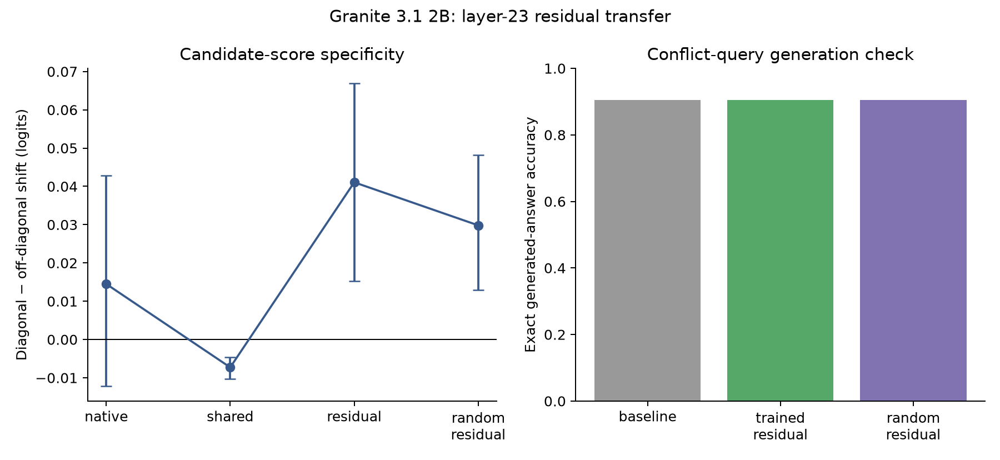

# Granite 3.1 2B residual transfer (experiment 021)

This third-family study trains food/service/value directions on synthetic training rows, then applies their layer-23 shared and residual components to TripR-2020Large. It uses 20 norm-matched random residual seeds on the 29 polarity-conflict sentences and a greedy exact-answer check. Review and generated text are omitted from this package.

- Full-set baseline all-vocabulary next-token top-1 accuracy: 81.3%; positive-vs-negative candidate-pair accuracy: 97.7%.
- Conflict-set baseline all-vocabulary next-token top-1 accuracy: 44.4%; positive-vs-negative candidate-pair accuracy: 88.9%.
- Conflict trained residual specificity: +0.133368 logits.
- Conflict random-seed mean: -0.002922; trained-minus-control +0.136290 (95% nested CI [+0.023378, +0.251955]).
- Monte Carlo rank p: 0.1429; score gate: FAIL.

Generated answer behavior on the conflict queries:
- **baseline:** exact one-word rate 100.0%; strict gold accuracy 90.5% (n=63).
- **trained_residual:** exact one-word rate 100.0%; strict gold accuracy 90.5% (n=63).
- **random_residual:** exact one-word rate 100.0%; strict gold accuracy 90.5% (n=63).

Paired behavior changes from baseline:
- **trained_residual:** 0 of 63 generated labels flipped; 0 accuracy gains and 0 harms.
- **random_residual:** 0 of 63 generated labels flipped; 0 accuracy gains and 0 harms.

The preregistered score gate remains failed: the one-sided random-seed rank was p=0.1429. The protocol's baseline-accuracy gate used all-vocabulary top-1; candidate-pair accuracy is also reported as a post hoc diagnostic because it is closer to the score endpoint. This tests one checkpoint from a third family, at one layer and dose, on the reused TripR benchmark. It is not by itself a general cross-model result. The [protocol](../../docs/experiments/021-granite-tripr-residual-transfer.md), per-seed outcomes, provenance, and integrity checks are included.
