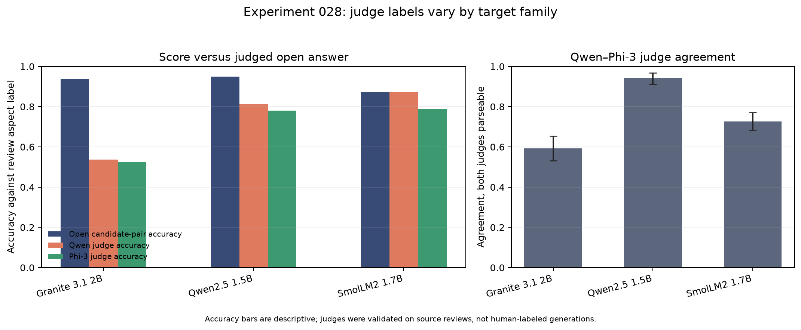

# Independent-family judge check (experiment 028)

The Phi-3 Mini judge passed its preregistered source-review gate at 94.4% accuracy
and 98.2% negative recall. On the regenerated open answers, agreement with the
Qwen2.5-3B judge varied by target family:

- Granite 3.1 2B: **59.3%** agreement (sentence-cluster bootstrap 95% CI
  53.1–65.4%); Qwen and Phi judged 53.6% and 52.4% correct against review labels.
- Qwen2.5-1.5B: **94.1%** agreement (91.0–96.9%); judged accuracy was 81.1% and
  78.1%.
- SmolLM2-1.7B: **72.7%** agreement (68.3–77.1%); judged accuracy was 87.1% and
  79.0%.

The strong Qwen agreement is the clearest part of the result. Granite remains
near chance under both judges, while the judges disagree more on SmolLM. The score
accuracies from the forced positive/negative candidate pair remain 93.6%, 94.8%,
and 87.1% and match experiment 025 exactly.

Phi-3's exact-label coverage on generated answers was 87.6% for Granite, 95.3% for
Qwen, and 97.4% for SmolLM; unparseable judge outputs count as incorrect in the
accuracy figures. Target generations were capped at the original eight-token limit.
The SemEval sample is 76.4% positive, so an always-positive baseline is also 76.4%:
for Qwen's open answers, the judges are only 4.7 and 1.7 points above that baseline;
for SmolLM they are 10.7 and 2.6 points above it. The candidate-pair score exceeds
that baseline much more strongly, but it predicts a constrained label rather than
proving the meaning of the generated sentence.

These are evaluator-robustness results, not verified answer accuracies: both judges
were screened on source reviews, not human-labeled generations. Agreement can still
be jointly wrong, and disagreement does not show which judge is wrong. LLM judge
biases and the need to compare against human judgments are established in prior work
([Zheng et al., 2023](https://arxiv.org/abs/2306.05685)). The next useful step is
blinded human coding of a stratified sample of the generated answers. No LessWrong
post is warranted yet.



The bundle contains IDs and labels only; no review or generated answer text is
retained. See the [frozen protocol](../../docs/experiments/028-independent-judge-check.md)
and [`analysis.json`](analysis.json).

Re-run the local capture and recompute its summary and audit:

```bash
PYTHONPATH=scripts .venv/bin/python scripts/independent_judge_check.py \
  --output /tmp/independent-judge-reproduction
PYTHONPATH=scripts .venv/bin/python scripts/analyze_independent_judge_check.py \
  --root /tmp/independent-judge-reproduction
```
