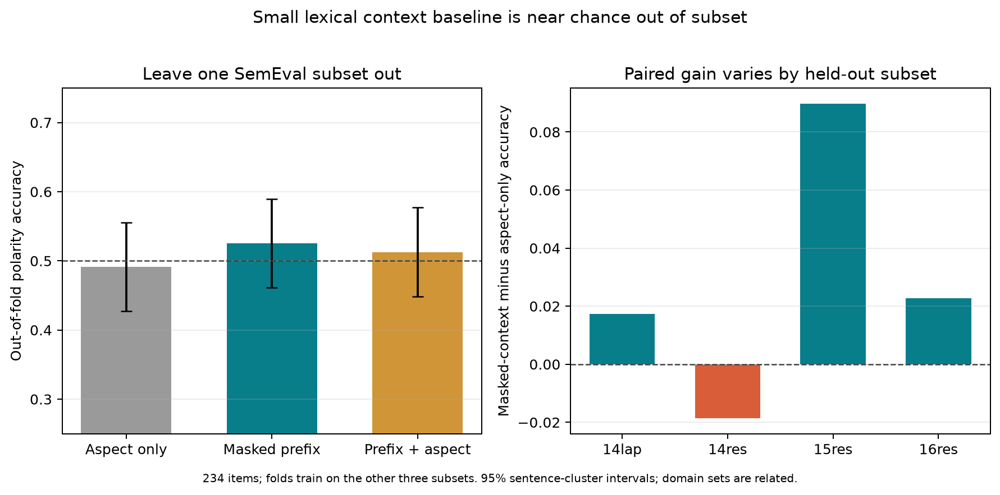

# Experiment 039: cross-subset lexical context baseline

The leave-one-SemEval-subset-out non-pretrained baseline did **not** pass its
registered context-signal gate. A word unigram/bigram TF-IDF logistic model reached
**52.6%** accuracy with target words masked from the natural pre-opinion prefix
(sentence-cluster bootstrap 95% CI **46.2–59.0%**), compared with **49.1%** for
aspect-only features (**42.7–55.6%**). The paired gain was **+3.4 percentage
points** (95% CI **−5.6 to +12.4**), below the preregistered 5-point threshold and
with an interval crossing zero. Including both target and context reached 51.3%
(44.9–57.7%).

| Held-out subset | Aspect-only | Target-masked prefix | Paired gain |
|---|---:|---:|---:|
| 14lap | 48.3% | 50.0% | +1.7 pp |
| 14res | 53.7% | 51.9% | −1.9 pp |
| 15res | 46.2% | 55.1% | +9.0 pp |
| 16res | 50.0% | 52.3% | +2.3 pp |

The lexical model's accuracy is far below Qwen/Phi's 73.5–77.8% forced-binary
accuracy on the same natural prefixes. This gap could reflect the small training
sets in these four held-out folds, domain-specific cues, pretrained linguistic
knowledge, or memorized examples. It does not by itself diagnose contamination,
and the null does not show that the natural prefixes lack information. The aspect
and restaurant splits are related, the train folds had only 156–190 examples, and
the result says little about broader review data.



All structural audits passed, including the 234-item hash-locked selection,
complete out-of-fold joins, and the check that no source review text appears in
the public bundle. The preregistered scientific gate correctly remains recorded as
**not passed** in [`audit.json`](audit.json). This is a useful boundary on the
current claim: context did not yield a reliable gain for this small lexical model
when the held-out subset changed.

The next check is an in-domain lexical baseline trained on the original ASTE train
partitions and tested on these fixed test IDs. That increases the training sample
and reduces domain mismatch; it still uses the same source dataset family, so it
will not be independent replication. LessWrong remains on hold.

## Reproduction

The frozen split and feature protocol are in
[`039-cross-subset-context-lexical-baseline.md`](../../docs/experiments/039-cross-subset-context-lexical-baseline.md).
The raw ASTE source files must be downloaded into ignored `.context/aste14res/`
using the source revision and hashes frozen in
[experiment 037](../natural-opinion-span-abstention-v1/README.md). Run:

```bash
python scripts/run_lexical_context_generalization_039.py
python scripts/analyze_lexical_context_generalization_039.py
python scripts/plot_lexical_context_generalization_039.py
```

The portable files are [`stimuli.json`](stimuli.json),
[`predictions.json`](predictions.json), [`manifest.json`](manifest.json),
[`analysis.json`](analysis.json), [`audit.json`](audit.json), and
[`SHA256SUMS`](SHA256SUMS). Per-item outputs contain IDs and labels only.

## Literature

- [Xu et al. (2020), *Position-Aware Tagging for Aspect Sentiment Triplet Extraction*](https://arxiv.org/abs/2010.02609) provides the target/opinion/polarity annotations.
- [Wang et al. (2023), *Reducing Spurious Correlations in Aspect-based Sentiment Analysis with Explanation from Large Language Models*](https://aclanthology.org/2023.findings-emnlp.193/) establishes that ABSA shortcuts are a known issue.
- [Xu et al. (2024), *Benchmark Data Contamination of Large Language Models: A Survey*](https://arxiv.org/abs/2406.04244) reviews benchmark contamination risks.
