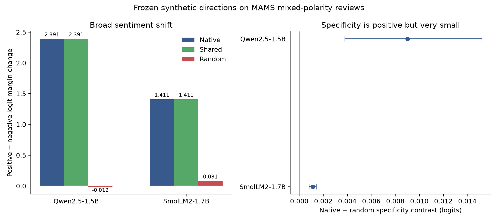

# MAMS conflict selectivity (experiment 015)

## Result

This is a held-out transfer test on the MAMS-ACSA benchmark, whose source paper constructed reviews with multiple aspects and differing polarities ([Jiang et al., EMNLP-IJCNLP 2019](https://aclanthology.org/D19-1654/)). The preregistered filter retained 35 test sentences and 71 queries across food/menu, service/staff and price/value, including 18 mapped-polarity conflict sentences. The MAMS authors' [repository](https://github.com/siat-nlp/MAMS-for-ABSA) provides the dataset. Raw text is excluded from this bundle.

The frozen native directions produce a positive target-matched specificity contrast in both local models, and the same sign appears in the 18 conflict-only cases:

- **qwen-1.5b:** baseline accuracy 78.9%; generic shift +2.3906; target-specific contrast +0.009030 logits (95% CI [+0.003786, +0.015216]), 0.38% of generic shift; conflict-only contrast +0.015925 (95% CI [+0.007716, +0.025624]).
- **smollm2-1.7b:** baseline accuracy 73.2%; generic shift +1.4106; target-specific contrast +0.001127 logits (95% CI [+0.000814, +0.001415]), 0.08% of generic shift; conflict-only contrast +0.001040 (95% CI [+0.000611, +0.001414]).

The effect is consistent, but it fails the preregistered 5%-of-generic-shift practical threshold in both models. The main interpretation remains a strong general positive sentiment bias with a much smaller target-aspect component. The small test set and category crosswalk limit generalization; this does not show an effect on every MAMS aspect.

**Preregistered cross-model practical-selectivity gate: FAIL.**



Protocol: [`015-mams-conflict-selectivity.md`](../../docs/experiments/015-mams-conflict-selectivity.md). `audit.json` verifies source/protocol/code/outcome hashes, exact factorial balance, analysis recomputation, and absence of review text. `SHA256SUMS` covers this bundle.

Reproduce with the local cached models:

```bash
PYTHONPATH=scripts:src .venv/bin/python scripts/mams_aspect_selectivity.py all --offline --resume
PYTHONPATH=scripts:src .venv/bin/python scripts/analyze_mams_aspect_selectivity.py
PYTHONPATH=scripts:src .venv/bin/python scripts/package_mams_aspect_selectivity.py \
  runs/mams-aspect-selectivity-v1 results/mams-aspect-selectivity-v1
```
