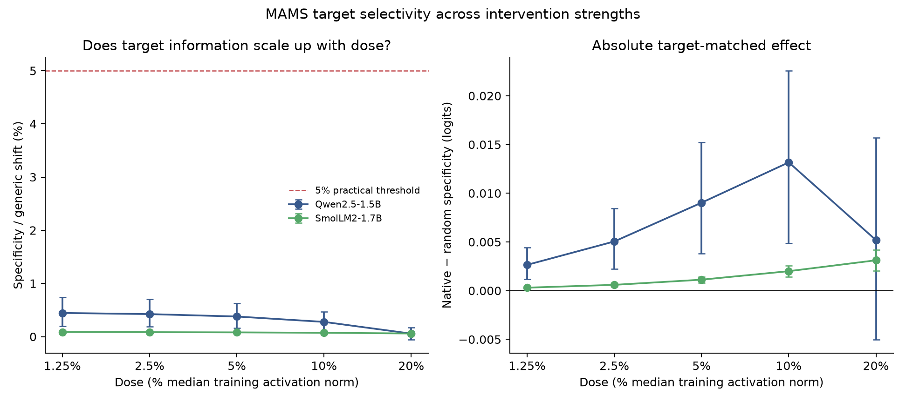

# MAMS dose response (experiment 016)

## Question

Does aspect selectivity grow faster than the generic positive sentiment shift as the fixed synthetic directions are applied more strongly?

## Result

The run uses the same frozen MAMS-ACSA test prompts and 008 direction vectors as experiments 015; only the dose changes. Each of five doses was tested on both models, with native, shared and norm-matched random controls. The sentence-level specificity-to-generic-shift ratio was bootstrapped over the 35 held-out MAMS sentences.

**qwen-1.5b:** ratio slope -0.00092 per log2 dose (95% CI [-0.00152, -0.00044]); any practical dose passed: False.
**smollm2-1.7b:** ratio slope -0.00007 per log2 dose (95% CI [-0.00008, -0.00005]); any practical dose passed: False.

The cross-model positive-ratio-trend gate failed, and the cross-model practical-dose gate failed. At the smallest dose, specificity was 0.445% of the generic shift for Qwen and 0.086% for SmolLM2; at 20%, it was 0.057% and 0.059%. At that highest dose, strict accuracy changed from 78.9% to 76.5% for Qwen and from 73.2% to 54.9% for SmolLM2. `analysis.json` reports baseline, native, shared and random-control accuracy at every dose; no dose was selected after seeing outcomes.



The protocol was written after experiment 015 and before these dose outcomes, so this is a planned exploratory follow-up to the MAMS result, not independent validation. Raw review text is excluded. `audit.json` checks all ten capture manifests, balance, exact code/data/protocol hashes and recomputed analyses; `SHA256SUMS` covers this bundle.

Protocol: [`016-mams-dose-response.md`](../../docs/experiments/016-mams-dose-response.md).

```bash
PYTHONPATH=scripts:src .venv/bin/python scripts/mams_dose_response.py all --offline --resume
PYTHONPATH=scripts:src .venv/bin/python scripts/analyze_mams_dose_response.py
PYTHONPATH=scripts:src .venv/bin/python scripts/package_mams_dose_response.py \
  runs/mams-dose-response-v1 results/mams-dose-response-v1
```
