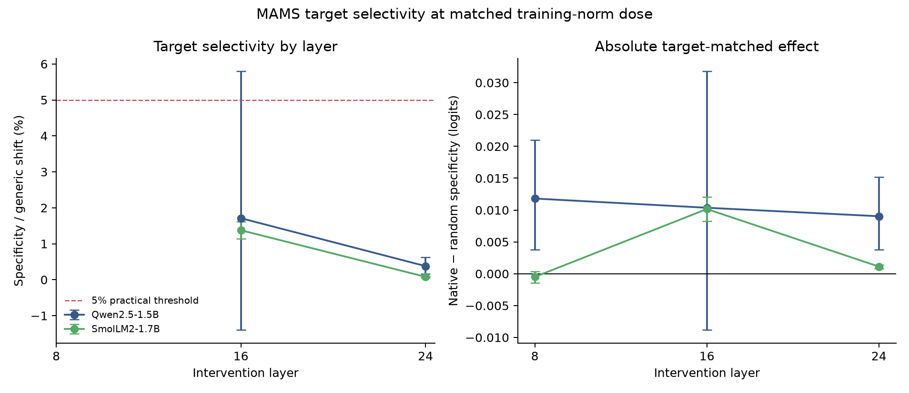

# MAMS layer selectivity (experiment 017)

## Result

This exploratory sweep applies training-only directions derived separately at layers 8, 16 and 24 to the same 35-sentence, 71-query MAMS-ACSA test filter used in experiment 015. Each layer uses a 5% dose of its own median training activation norm and native, shared and norm-matched random controls. The 18-sentence conflict slice is included in `analysis.json`.

- **qwen-1.5b, layer 8:** baseline 78.9%; generic shift -0.0096; specificity +0.011809 logits (95% CI [+0.003774, +0.021029]); ratio undefined (no reliable positive generic shift); practical gate False.
- **qwen-1.5b, layer 16:** baseline 78.9%; generic shift +0.6059; specificity +0.010363 logits (95% CI [-0.008844, +0.031785]); 1.710% of generic shift; practical gate False.
- **qwen-1.5b, layer 24:** baseline 78.9%; generic shift +2.3887; specificity +0.009031 logits (95% CI [+0.003786, +0.015217]); 0.378% of generic shift; practical gate False.
- **smollm2-1.7b, layer 8:** baseline 73.2%; generic shift -0.0059; specificity -0.000487 logits (95% CI [-0.001449, +0.000333]); ratio undefined (no reliable positive generic shift); practical gate False.
- **smollm2-1.7b, layer 16:** baseline 73.2%; generic shift +0.7386; specificity +0.010160 logits (95% CI [+0.008244, +0.012026]); 1.376% of generic shift; practical gate False.
- **smollm2-1.7b, layer 24:** baseline 73.2%; generic shift +1.4102; specificity +0.001127 logits (95% CI [+0.000814, +0.001415]); 0.080% of generic shift; practical gate False.

No layer was selected after seeing results. The practical gate is frozen at at least 5% specificity relative to generic shift, positive specificity interval and above-chance baseline accuracy. This is one benchmark and two model families; any layer-dependent signal needs independent confirmation.

An explicitly **post-hoc, unadjusted** paired comparison found a layer-16 minus layer-24 specificity difference of +0.009033 logits for SmolLM2 (sentence-bootstrap 95% CI [+0.007219, +0.010944]); on the 18 conflict sentences the difference was +0.010131 (95% CI [+0.007149, +0.013129]). Qwen's same all-sentence contrast was +0.001332 (95% CI [-0.018818, +0.022586]). These post-hoc comparisons were not preregistered and do not establish a cross-model layer effect; the SmolLM2 pattern needs a locked independent replication.

For the preregistered relative endpoint, the paired layer-16 minus layer-24 specificity-fraction difference was +1.30 percentage points in SmolLM2 (95% CI [+1.07, +1.52]) and +1.33 points in Qwen (95% CI [-1.85, +5.31]). This ratio comparison is also post-hoc and unadjusted; only the SmolLM2 interval excludes zero.

Protocol: [`017-mams-layer-selectivity.md`](../../docs/experiments/017-mams-layer-selectivity.md). `audit.json` checks all six capture manifests, data and code hashes, factorial balance, analysis recomputation and absence of review text. `SHA256SUMS` covers the bundle.
