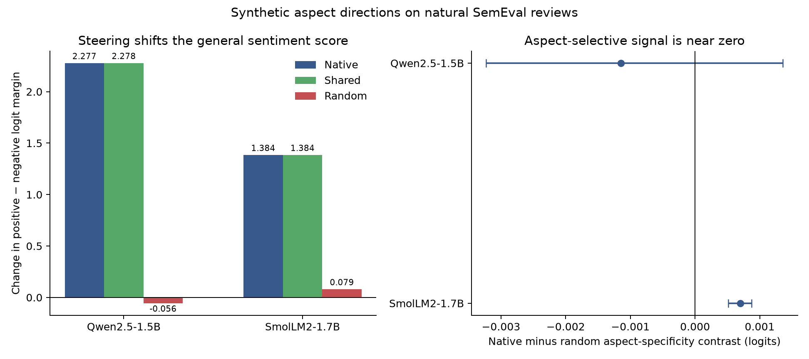

# Natural aspect selectivity (experiment 014)

## Question

Do frozen aspect-specific directions learned from synthetic reviews selectively move the sentiment score for the matching aspect when applied to human-annotated, multi-aspect restaurant reviews?

## Results

The unsteered models perform well on the included aspect queries, and the native directions cause a large positive-minus-negative logit shift. The primary within-sentence contrast is much smaller:

- **qwen-1.5b:** baseline accuracy 94.8%; mean native shift +2.2769 logits; native-minus-random specificity -0.001144 (sentence bootstrap 95% CI [-0.003230, +0.001358]); 112 sentences; baseline accuracy on negative labels 98.2% and positive labels 93.8%.
- **smollm2-1.7b:** baseline accuracy 92.3%; mean native shift +1.3839 logits; native-minus-random specificity +0.000698 (sentence bootstrap 95% CI [+0.000515, +0.000872]); 112 sentences; baseline accuracy on negative labels 98.2% and positive labels 90.4%.

This supports a generic valence-shift interpretation more than a useful aspect-selective-control interpretation. SmolLM2 has a positive interval in the frozen contrast, but the estimate is roughly 0.0007 logits against a general shift above 1.3 logits; Qwen is centered near zero. The polarity-disagreement slice contains only eight sentences and is descriptive. Also, 178 of 233 prompts (76.4%) are positive-labeled, so the small overall accuracy gain under positive steering is sensitive to class balance: it rises from 94.8% to 95.3% on Qwen and from 92.3% to 93.8% on SmolLM2. Looking by class makes the tradeoff visible: negative-label accuracy falls from 98.2% to 94.5% on Qwen and 89.1% on SmolLM2, while positive-label accuracy rises. The intervention is making the model more positive overall; it is not reliably correcting the requested aspect. This is another reason not to read the logit movement as target-specific behavioral control. The run does not establish useful naturalistic aspect-specific steering.



The official [SemEval-2014 Task 4 description](https://alt.qcri.org/semeval2014/task4/index.php) defines aspect-category polarity and documents human annotations. The experiment used the public gold XML mirrored at [HSLCY/ABSA-BERT-pair](https://github.com/HSLCY/ABSA-BERT-pair/blob/master/data/semeval2014/Restaurants_Test_Gold.xml), SHA-256 `f21509cfa37e16534cd5b2da043be487355b64ef48fe8d6aaacaeca6b49cc0fb`. The raw file is not redistributed here. Steering answer-encoding confounds have also been directly examined by [Gao et al. (2026)](https://arxiv.org/html/2608.22985v1); this experiment asks a different, narrow generalization question about aspect selectivity on natural reviews.

Protocol: [`014-natural-aspect-selectivity.md`](../../docs/experiments/014-natural-aspect-selectivity.md). The bundle includes every anonymized row-level logit outcome, model manifests, the frozen analysis, and integrity audit. It contains no review text.

Reproduce the local run and package from the frozen protocol:

```bash
PYTHONPATH=scripts:src .venv/bin/python scripts/natural_aspect_selectivity.py all --offline --resume
PYTHONPATH=scripts:src .venv/bin/python scripts/analyze_natural_aspect_selectivity.py
PYTHONPATH=scripts:src .venv/bin/python scripts/package_natural_aspect_selectivity.py \
  runs/natural-aspect-selectivity-v1 results/natural-aspect-selectivity-v1
```

`audit.json` checks source, model-capture, code and protocol hashes; factorial balance; outcome counts; text exclusion; and deterministic analysis. `SHA256SUMS` covers this bundle.
