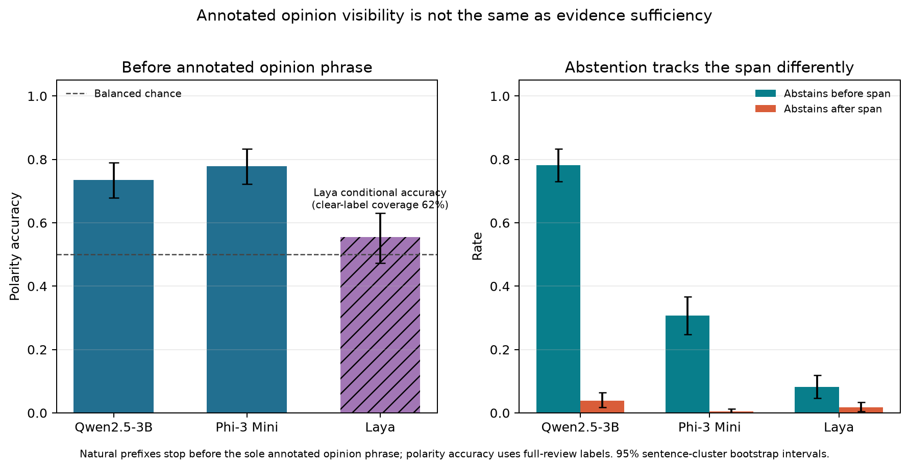

# Experiment 037: natural opinion-span visibility and abstention

## Main finding

In natural restaurant/laptop review prefixes ending **before** the only
human-annotated opinion phrase, the two local generative judges still predicted
the full-review polarity well above chance: Qwen2.5-3B reached **73.5%**
(sentence-cluster bootstrap 95% CI **67.9–79.1%**) and Phi-3 Mini **77.8%**
(**72.2–83.3%**) on 234 balanced items. That means “the annotated opinion span is
not visible” is not equivalent to “the polarity is unknowable.” This construct
validity issue is more informative than the preregistered wrapper score.

The explicit-abstention wrapper passed the registered operational rule, improving
appropriate-decision accuracy by **26.8 percentage points** pooled across judges
and both prefix states (95% CI **24.5–29.2**). But its pre-span “insufficient” gold
was defined by annotation visibility. The forced classifiers’ strong polarity
prediction shows that these prefixes can contain predictive information, whether
from genuine surrounding context, learned aspect priors, or exposure to old review
text during pretraining. Therefore the pass does **not** show that the models should
have abstained in these natural excerpts.

## The policy split

On the prefix before the annotated phrase, Qwen abstained on **78.2%** of cases
(95% CI 73.1–83.3), while Phi abstained on **30.8%** (24.8–36.8). Their paired
abstention-recall difference was **47.4 points** (Qwen minus Phi; CI 41.0–53.8).
When the abstention-enabled wrapper did answer with a polarity, its accuracy against
the full-review label was 82.4% for Qwen and 80.9% for Phi. Laya's typed four-way
decision abstained (`unclear`) on only 8.1% of pre-span excerpts (4.7–12.0), gave a
clear polarity on 62.4%, and was correct on 55.5% of those clear decisions
(47.3–63.0).

After the full annotated opinion phrase became visible, forced-binary polarity
accuracy was 96.6% for Qwen and 96.2% for Phi. The abstention wrapper scored 94.4%
and 96.6%, respectively; false-abstention rates were 3.8% and 0.4%. Laya's
false-abstention rate was 1.7%, and its appropriate-decision accuracy was 82.5%.



The preregistered primary metric is included in [`analysis.json`](analysis.json),
and all source, balance, join, hash, and text-release checks passed in
[`audit.json`](audit.json). The per-dataset wrapper gains were +22.7 to +30.4
points, but the same construct-validity issue applies in each split.

## Interpretation and limits

ASTE defines target/opinion/sentiment triplets and the source sets used here are
small SemEval test splits. Prior ABSA work already studies spurious correlations,
and broad LLM abstention benchmarks are established. The result is a lead about
the mismatch between an annotated rationale span and evidence sufficiency, not a
new abstention method or general judge claim. The prompt changes both the allowed
labels and the instructions. “Before span” can still contain implicit or
unannotated evidence. The judgments use only two generative checkpoints and the
local Laya decision engine.

The 2014–2016 reviews may also have appeared in model pretraining. Benchmark
contamination is a known evaluation risk; this run cannot distinguish memorized
completion from context-based polarity inference. The source data repository has
no explicit license metadata, so raw text and free-form model responses are kept
private. The public bundle contains only source line/span IDs and parsed labels.

The next frozen control asks whether the high pre-span polarity accuracy remains
when all review words are removed but the named aspect and full-review gold stay
the same. That separates an aspect prior from information in the natural prefix.
Until then, this does not justify a LessWrong post.

## Reproduction

The protocol and selected line/span IDs are frozen in
[`037-natural-opinion-span-abstention.md`](../../docs/experiments/037-natural-opinion-span-abstention.md)
and [`037-stimuli.json`](../../docs/experiments/037-stimuli.json). Download the four
`test_triplets.txt` files from the pinned ASTE-Data-V2 revision into ignored
`.context/aste14res/` using the file names listed in the protocol. Then run:

```bash
python scripts/run_natural_opinion_span_abstention_037.py
python scripts/analyze_natural_opinion_span_abstention_037.py
python scripts/plot_natural_opinion_span_abstention_037.py
```

The portable artifacts are [`stimuli.json`](stimuli.json),
[`predictions.json`](predictions.json), [`manifest.json`](manifest.json),
[`analysis.json`](analysis.json), and [`audit.json`](audit.json). Per-example rows
contain no review text.

## Literature

- [Xu et al. (2020), *Position-Aware Tagging for Aspect Sentiment Triplet Extraction*](https://arxiv.org/abs/2010.02609) defines the target, opinion span, and sentiment triplet task.
- [Kirichenko et al. (2025), *AbstentionBench*](https://arxiv.org/abs/2506.09038) evaluates broad abstention behavior on unanswerable questions.
- [Wang et al. (2023), *Reducing Spurious Correlations in Aspect-based Sentiment Analysis with Explanation from Large Language Models*](https://aclanthology.org/2023.findings-emnlp.193/) directly establishes spurious-correlation concerns in ABSA.
- [Xu et al. (2024), *Benchmark Data Contamination of Large Language Models: A Survey*](https://arxiv.org/abs/2406.04244) discusses contamination risks for benchmark evaluations.
- [ASTE-Data-V2 source and schema](https://github.com/xuuuluuu/SemEval-Triplet-data).
