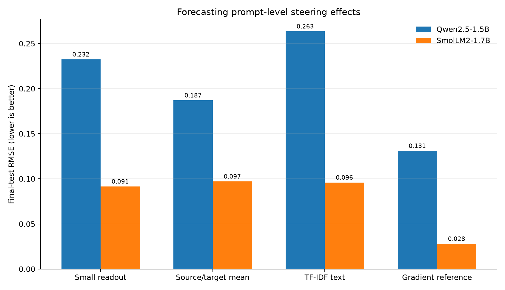

# Prompt-level steering-effect forecast (experiment 010)

## Finding

The prespecified requirement—at least 10% lower test RMSE than the source/target mean in both models, with group-bootstrap intervals below zero—**was not met**. The small readout was worse than the mean baseline on Qwen and had only a small, uncertain gain on SmolLM2. The gradient reference was substantially more accurate on both models. This is a useful negative result about this low-cost forecaster, not evidence that prompt-specific effects cannot be forecast.

- **qwen-1.5b:** small-readout RMSE 0.2323; pair-mean 0.1869; gradient reference 0.1309. Readout-vs-mean relative improvement -24.3%; paired group-bootstrap RMSE-difference 95% interval [+0.0262, +0.0631].
- **smollm2-1.7b:** small-readout RMSE 0.0914; pair-mean 0.0970; gradient reference 0.0279. Readout-vs-mean relative improvement 5.7%; paired group-bootstrap RMSE-difference 95% interval [-0.0224, +0.0102].



Every final-test intervention increased the queried positive-minus-negative score. The 100% sign-accuracy values are therefore degenerate and carry no evidence of useful sign prediction. Effects were all positive even for cross-aspect source/target pairs. This pattern, plus strongly aligned training directions, motivates experiment 011's shared-component control.

The target is a finite change in a synthetic candidate-label logit, not a real-world behavioral probability. The small model readout used an unsteered layer-24 activation and source/target query encoding. The gradient reference uses a model-specific derivative and is an upper-information reference, not a cheap deployable forecast. Bootstrap intervals resample 24 scenario groups; conclusions are conditional on these synthetic prompts and two small models.

The nearest direct recent work we found predicts behavior-pair side effects pooled across contexts ([Ong et al. 2026](https://arxiv.org/html/2608.11227v1)). This experiment asked a narrower prompt-specific forecasting question, but its prespecified readout gate failed, so it does not support a LessWrong research claim by itself. Broader geometric reliability work is also relevant ([Braun 2025](https://arxiv.org/abs/2505.22637); [Imdad 2026](https://zenodo.org/records/20710572)). A further geometric decomposition separates steering-induced angular and radial changes ([Aparin & Gaintseva 2026](https://arxiv.org/abs/2606.06735)); the local experiment 011 uses a different shared-task-direction decomposition and will be interpreted narrowly.

Protocol: [`010-prompt-level-effect-forecast.md`](../../docs/experiments/010-prompt-level-effect-forecast.md). Reproduce the analysis from ignored local captures with:

```bash
uv run python scripts/prompt_effect_forecast.py analyze --root runs/prompt-effect-forecast-v1
uv run python scripts/package_prompt_effect_forecast.py \
  runs/prompt-effect-forecast-v1 results/prompt-effect-forecast-v1
```

Full per-row outcomes and gradient records are gzip-compressed here; activations are excluded. `audit.json` validates row counts, group counts, checkpoint hashes, and protocol-commit provenance. `SHA256SUMS` covers every file in this bundle.
