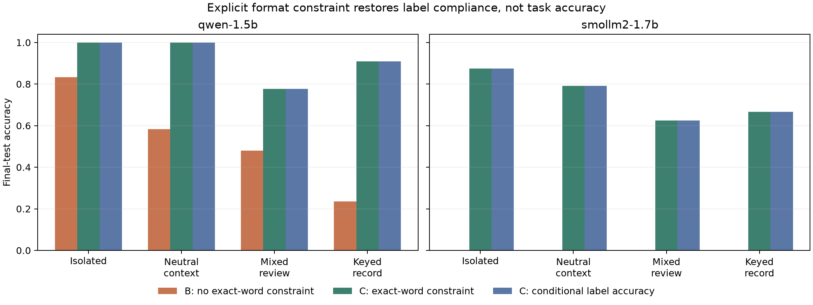

# Response-constraint control 009: label compliance returns, task accuracy does not

**Run 23 September 2026 on the MacBook Air M5 (24 GB).** Qwen2.5-1.5B and SmolLM2-1.7B each completed 11,520 paired prompts across four task structures, three sentiment aspects, three prompt conditions, and the frozen group/cue splits. The [protocol](../../docs/experiments/009-output-constraint-control.md) was committed before the saved run outputs were collected. This is a target-behavior study; it did not fit activation probes.

The exact-word instruction had a large effect on output compliance. For SmolLM2 on final-test prompts, format B (alternate wording without the explicit one-word constraint) produced **zero positive/negative first tokens**. Adding only the explicit answer constraint in format C raised valid-label output to 100% across all four task structures. But this did not restore task accuracy to the 90% predeclared rescue threshold:

| Task | SmolLM B strict | SmolLM C strict | SmolLM C conditional label accuracy |
| --- | ---: | ---: | ---: |
| Isolated clause | 0.0% | 87.5% | 87.5% |
| Neutral distractors | 0.0% | 79.2% | 79.2% |
| Mixed review | 0.0% | 62.5% | 62.5% |
| Keyed record | 0.0% | 66.7% | 66.7% |

SmolLM's conditional positive/negative ranking was already 100% on each simple task in format B; after adding the constraint, simple-task conditional accuracy averaged 83.3%. The mixed-review score moved from 70.5% to 62.5%. Thus, a simple “free-response formatting failure only” explanation does not pass the predeclared composite rule. The constraint fixes whether a label token is emitted, while exact aspect sentiment remains unreliable and the conditional label scores change with the new wording. Qwen's format C reached 100% on both simple tasks, 77.8% on mixed reviews, and 91.0% on keyed records.

Format 0 (the original wording with an explicit one-word instruction) had given SmolLM 100% on both simple tasks, 69.4% on mixed reviews, and 69.4% on keyed records. Therefore, format C's strong compliance does not mean its content accuracy matches the original prompt. The paired B-to-C group-bootstrap intervals for every aspect/task are in `analysis.json`; all individual outputs, IDs, contexts and scores are retained in the compressed data files. The chart compares strict exact-token accuracy and conditional candidate-label accuracy on the final test.



## Interpretation and prior work

This is a useful local diagnostic but not a novel result suitable for a LessWrong research post. Prior work already studies format adherence separately from content quality: [FOFO](https://aclanthology.org/2024.acl-long.40/) reports that format proficiency can vary independently of content generation quality; [LLMs Are Biased Towards Output Formats](https://arxiv.org/abs/2408.08656) explicitly separates accuracy under compliance from accuracy regardless of compliance; and 2026's [MOSAIC instruction-compliance benchmark](https://aclanthology.org/2026.eacl-long.62/) studies constraint-specific adherence and interactions. Our paired two-model result is narrower, uses synthetic sentiment templates, and does not advance the activation-readout hypothesis. It is not sufficiently surprising or broad to justify a public post.

The main research program's precondition remains unmet: no task in experiment 008 cleared the cross-family strict-generation gate. So there are still no probe, calibration, or intervention results for this task ladder. The 3B scale run remains excluded after it was stopped for sustained memory paging in experiment 008.

The final saved captures took 25.4 minutes for Qwen and 30.6 minutes for SmolLM2 on MPS. An initial Qwen pass was discarded after a JSON serialization error; the corrected checkpointed capture was rerun from the beginning and is the only Qwen result included. The compact bundle has complete predictions, manifests, paired intervals, audit JSON, and SHA-256 checksums. Activations were never collected for 009. To regenerate the analysis and package from local runs:

```bash
uv run python scripts/response_policy_control.py analyze --root runs/response-policy-control-v1
uv run python scripts/package_response_policy_control.py \
  runs/response-policy-control-v1 results/response-policy-control-v1
```
