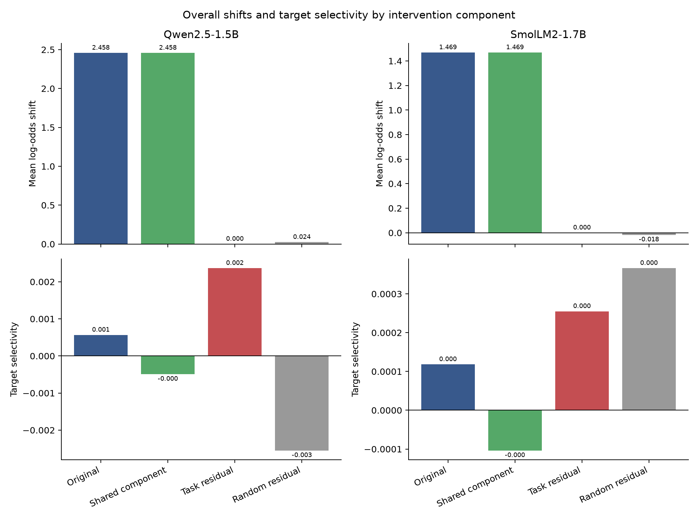

# Shared-versus-residual steering control (experiment 011)

This paired experiment decomposes three training-only task directions into a shared component and orthogonal residuals, then measures each on the same held-out prompts. Components retain their natural norms; random residual controls are norm-matched.

## Frozen decision rule

Residual-specific steering is supported only if residual target selectivity exceeds both the shared component and the matched random residual with paired 24-group bootstrap 95% intervals entirely above zero in both models. The analysis preserves all source-by-target cells and overall shifts. A failed criterion is reported as a negative or mixed local result, not repaired by selecting cells after inspection.

## Results

- **qwen-1.5b:** selectivity original +0.0006, shared -0.0005, residual +0.0024, random residual -0.0026; residual-minus-shared 95% CI [+0.0010, +0.0049], residual-minus-random 95% CI [+0.0035, +0.0064].
- **smollm2-1.7b:** selectivity original +0.0001, shared -0.0001, residual +0.0003, random residual +0.0004; residual-minus-shared 95% CI [+0.0002, +0.0006], residual-minus-random 95% CI [-0.0003, +0.0001].

The frozen rule **failed**: the residual-minus-random interval crosses zero for SmolLM2. The residual exceeded the shared component in both models, but the protocol requires both comparisons in both models.

Overall intervention shifts:

- **qwen-1.5b:** overall mean log-odds change was original +2.4580, shared +2.4578, residual +0.0004, random residual +0.0242.
- **smollm2-1.7b:** overall mean log-odds change was original +1.4691, shared +1.4692, residual +0.0001, random residual -0.0176.



Training-direction geometry for **qwen-1.5b** has pairwise cosine matrix `[[1.0, 0.957, 0.936], [0.957, 1.0, 0.924], [0.936, 0.924, 1.0]]`.
Training-direction geometry for **smollm2-1.7b** has pairwise cosine matrix `[[1.0, 0.862, 0.848], [0.862, 1.0, 0.892], [0.848, 0.892, 1.0]]`.

These finite log-odds interventions concern a synthetic candidate-label task, not real-world behavior. The unit of uncertainty is 24 constructed scenario groups. This study is small, runs on two sub-2B models, and tests one layer and one dose. Even a positive result needs independent tasks and naturalistic outcomes before making a field-level claim.

Relevant prior work already studies intervention-side-effect prediction and geometric decompositions ([Ong et al. 2026](https://arxiv.org/html/2608.11227v1); [Aparin & Gaintseva 2026](https://arxiv.org/abs/2606.06735); [Shen et al. 2026](https://arxiv.org/abs/2606.08365)). The current result is a local component control within this benchmark. It does not establish a new general steering method. Protocol: [`011-shared-vs-residual-steering.md`](../../docs/experiments/011-shared-vs-residual-steering.md).

Reproduce analysis and package from the ignored local capture:

```bash
uv run python scripts/shared_residual_steering.py analyze --root runs/shared-residual-steering-v1
uv run python scripts/package_shared_residual_steering.py \
  runs/shared-residual-steering-v1 results/shared-residual-steering-v1
```

The gzip archives retain every per-prompt effect; activations are excluded. `audit.json` checks integrity, row balance, group coverage and protocol provenance. `SHA256SUMS` covers the bundle.
