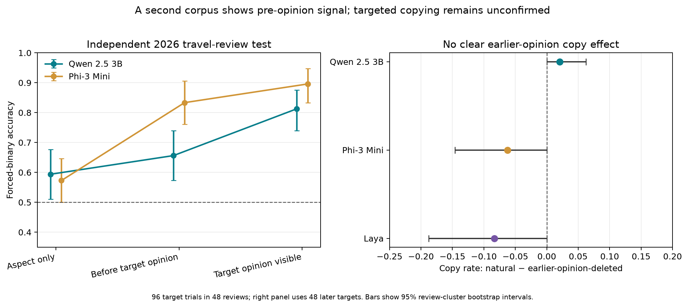

# Experiment 040 — cross-aspect prior-opinion interference

## What we asked

In 48 travel reviews where both annotators agreed on one positive and one
negative aspect, does a model carry the earlier aspect's opinion onto the later
aspect before the later aspect's own annotated opinion phrase appears? We
deleted only that earlier opposite-polarity phrase for the later target and
compared its label to the natural-prefix response.

## Main result

The preregistered Qwen2.5-3B copy-rate difference was **+2.1 percentage points**
for natural versus earlier-opinion-deleted text (95% review-cluster bootstrap
interval **0.0 to +6.3 points**). Qwen copied the opposite prior label on
**27.1%** of natural prefixes and **25.0%** after the phrase was deleted. Its
target accuracy was 72.9% and 75.0%, respectively. The required interval-above-
zero and 5-point effect gate **did not pass**. This run does not show that an
earlier aspect's sentiment is systematically transferred to the later one.

There is a more encouraging, predeclared secondary result: for Phi-3 Mini, the
natural-prefix accuracy across all 96 target trials was **83.3%**, versus
**57.3%** with only the aspect term. The paired gain was **+26.0 points** (95%
review-cluster interval **+16.7 to +35.4**). With the target opinion phrase
visible, accuracy rose to **89.6%**. Qwen's corresponding natural-prefix gain
was only +6.3 points (interval −5.2 to +17.7), while its visible-opinion score
was 81.3%. Both target polarities were correct in 68.8% of the mixed-review
pairs for Phi and 39.6% for Qwen under natural prefixes.

Laya returned a binary polarity on 76.0% of natural-prefix trials; among those
clear labels its accuracy was 82.2%. It marked 97.9% of aspect-only prompts
`unclear`. Qwen's explicit-abstention wrapper answered only 12.5% of natural
prefixes, compared with Phi's 81.3%. These remain model- and prompt-dependent
behaviors, not human measures of evidence sufficiency.



## Interpretation and limits

The independent TRABL test split reproduces a strong pre-opinion context signal
for Phi on this balanced set, despite the small cross-subset lexical baseline in
Experiment 039. The targeted earlier-opinion deletion hypothesis did not pass:
Qwen's primary copy-rate estimate was small and its interval touched zero; Phi
and Laya also showed no positive copy effect. The corpus is selected, contains
only 48 review clusters, and is not an independently collected human study.
TRABL's labels began with LLM suggestions followed by human corrections, and
the source reviews might have been included in model pretraining even though
the dataset itself was released in 2026. Deleting the earlier phrase also
changes fluency. These results motivate another controlled check; they do not
justify a general claim about reasoning or model self-knowledge. LessWrong
remains deferred.

The protocol's primary endpoint and gate were unchanged. A small
[analysis amendment](../../docs/experiments/040-analysis-amendment.md) adds the
review-cluster intervals that the preregistered protocol specified for secondary
accuracy outcomes; it does not alter the primary result or use new judgments.

## Run and provenance

All 1,680 judgments ran sequentially on local MPS on the 24GB MacBook Air, with
no fine-tuning or API calls. Inference time was 11.2 seconds for Laya, 497.5
seconds for Qwen2.5-3B, and 273.0 seconds for Phi-3 Mini. The pinned revisions,
source hash, model revisions, output hashes and Laya warning are recorded in
[`manifest.json`](manifest.json). The complete deterministic analysis is in
[`analysis.json`](analysis.json), and [`audit.json`](audit.json) confirms all
96 target trials and 1,680 outputs join to the frozen selection with no raw
review text in public rows.

The source is
[TRABL, Booking-com/absa-dataset](https://huggingface.co/datasets/Booking-com/absa-dataset),
released under CC BY-SA 4.0 for non-commercial research use per its dataset
card. We attribute the data to Madmon et al., *TRABL: A Unified Framework for
Travel Domain Aspect-Based Sentiment Analysis Applications of Large Language
Models*, WWW 2026, [doi:10.1145/3774904.3792835](https://doi.org/10.1145/3774904.3792835).
The portable bundle includes selection offsets and labels, not the review text.
Derived data in this directory is shared under CC BY-SA 4.0; code remains under
the repository's code license.

Reproduce after downloading the pinned `test.jsonl` into ignored
`.context/trabl/`:

```bash
python scripts/run_trabl_prior_opinion_interference_040.py
python scripts/analyze_trabl_prior_opinion_interference_040.py
python scripts/plot_trabl_prior_opinion_interference_040.py
```
