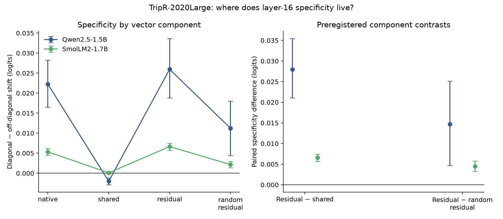

# Where does layer-16 aspect specificity live? (experiment 019)

This preregistered decomposition reuses the TripR-2020Large prompts from 018. It is a mechanism follow-up, not an independent replication. Frozen layer-16 training-only food/service/price directions were split into their shared-sentiment projections and orthogonal aspect residuals. Each natural component was applied at the same 5% training-activation-norm dose, with norm-matched random residual controls.

## qwen-1.5b

Baseline strict accuracy: 95.8%; 187 sentences, 29 polarity-conflict sentences.
- **native:** specificity +0.022247 logits (95% CI [+0.016503, +0.028255]); generic shift +0.1855; strict accuracy 95.7%.
- **shared:** specificity -0.002021 logits (95% CI [-0.002895, -0.001201]); generic shift +0.1871; strict accuracy 95.8%.
- **residual:** specificity +0.025950 logits (95% CI [+0.018793, +0.033643]); generic shift -0.0016; strict accuracy 95.8%.
- **random_residual:** specificity +0.011233 logits (95% CI [+0.004380, +0.018000]); generic shift -0.0042; strict accuracy 95.8%.
- **residual − shared:** +0.027971 logits (95% paired sentence-bootstrap CI [+0.021051, +0.035468]).
- **residual − random residual:** +0.014717 logits (95% paired sentence-bootstrap CI [+0.004684, +0.025141]).

## smollm2-1.7b

Baseline strict accuracy: 91.9%; 187 sentences, 29 polarity-conflict sentences.
- **native:** specificity +0.005343 logits (95% CI [+0.004448, +0.006215]); generic shift +0.5848; strict accuracy 92.2%.
- **shared:** specificity +0.000092 logits (95% CI [+0.000046, +0.000139]); generic shift +0.5851; strict accuracy 92.2%.
- **residual:** specificity +0.006645 logits (95% CI [+0.005732, +0.007517]); generic shift -0.0002; strict accuracy 91.9%.
- **random_residual:** specificity +0.002159 logits (95% CI [+0.001352, +0.002923]); generic shift -0.0068; strict accuracy 91.9%.
- **residual − shared:** +0.006552 logits (95% paired sentence-bootstrap CI [+0.005655, +0.007465]).
- **residual − random residual:** +0.004486 logits (95% paired sentence-bootstrap CI [+0.003194, +0.005796]).

**Residual-mechanism gate:** PASS.

Raw TripR review text is excluded. The local dataset is attributed under CC BY-SA 4.0 in `DATA_ATTRIBUTION.md`. See the [preregistered protocol](../../docs/experiments/019-tripr-shared-residual-layer16.md).
