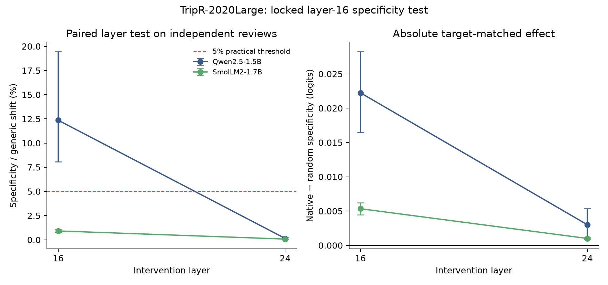

# Independent layer-16 test (experiment 018)

## Result

This preregistered comparison evaluates frozen training-only directions at layers 16 and 24 on TripR-2020Large, a separate TripAdvisor review collection from the MAMS and SemEval restaurant sets. The frozen label filter retained 187 sentences, 385 mapped aspect queries and 29 cross-aspect polarity conflicts. Each layer uses a 5% dose of its own median training activation norm, with native, shared and norm-matched random controls.

- **qwen-1.5b, layer 16:** baseline 95.8%; generic shift +0.1801; specificity +0.022249 logits (95% CI [+0.016435, +0.028237]); specificity fraction 12.356%; conflict-only specificity +0.036045.
- **qwen-1.5b, layer 24:** baseline 95.8%; generic shift +2.1645; specificity +0.003011 logits (95% CI [+0.000948, +0.005343]); specificity fraction 0.139%; conflict-only specificity +0.027875.
- **smollm2-1.7b, layer 16:** baseline 91.9%; generic shift +0.5841; specificity +0.005342 logits (95% CI [+0.004448, +0.006238]); specificity fraction 0.915%; conflict-only specificity +0.007613.
- **smollm2-1.7b, layer 24:** baseline 91.9%; generic shift +1.3272; specificity +0.001008 logits (95% CI [+0.000874, +0.001139]); specificity fraction 0.076%; conflict-only specificity +0.001191.

Primary paired layer-16 minus layer-24 specificity-fraction differences:

- **qwen-1.5b:** layer-16 minus layer-24 ratio difference +12.22 percentage points (95% CI [+7.94, +19.37]).
- **smollm2-1.7b:** layer-16 minus layer-24 ratio difference +0.84 percentage points (95% CI [+0.69, +0.98]).

**Cross-model localization replication gate: PASS.** **Cross-model practical layer-16 gate (5% specificity fraction): FAIL.** The paired comparison and practical threshold were frozen before model outcomes. See `analysis.json` for controls, strict accuracies and all sentence-bootstrap intervals.

## Data attribution and license

TripR-2020Large, by Zuheros et al., is distributed under [CC BY-SA 4.0](https://creativecommons.org/licenses/by-sa/4.0/). The raw reviews remain local and are omitted here. This bundle contains only review identifiers, mapped labels, model scores and aggregate statistics. Cite: C. Zuheros et al., “Crowd Decision Making: Sparse Representation Guided by Sentiment Analysis for Leveraging the Wisdom of the Crowd,” IEEE TSMC: Systems (2022), [doi:10.1109/TSMC.2022.3180938](https://doi.org/10.1109/TSMC.2022.3180938). `DATA_ATTRIBUTION.md` records the source revision and license.

Protocol: [`018-independent-tripadvisor-layer16.md`](../../docs/experiments/018-independent-tripadvisor-layer16.md). `audit.json` checks the four captures, hashes, factorial balance, recomputed analysis and absence of review text. `SHA256SUMS` covers the bundle.
