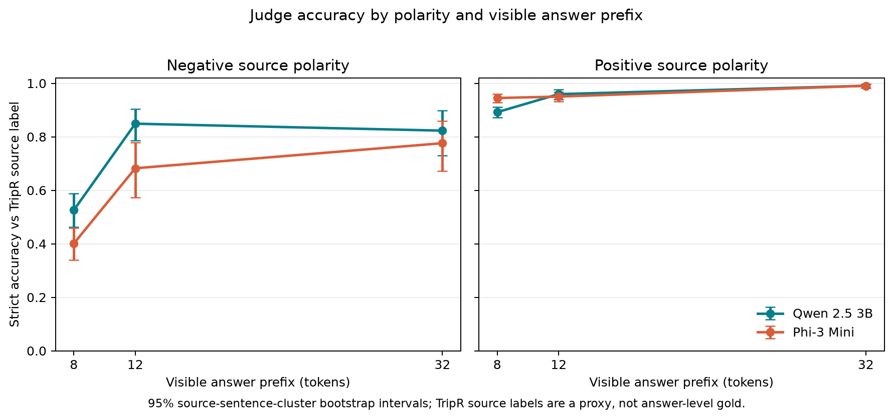

# Experiment 034 — TripR prefix threshold

This preregistered follow-up applies three fixed judges to nested 8-, 12- and
32-token prefixes of answers generated from 385 aspect queries over 187
TripR-2020Large restaurant-review sentences. It changes the source corpus while
keeping the task and judge families fixed. The complete factorial contains
10,395 item × target model × judge × prefix outcomes.

## Main result

The paired Qwen/Phi agreement increase from 8 to 12 tokens was **+4.2 percentage
points** (sentence-cluster 95% bootstrap CI **+2.5 to +5.7 pp**, 1,081 paired
item-target rows across 187 sentences). Laya's mixed/unclear rate fell by
**13.9 pp** (95% CI −17.1 to −10.8 pp). Agreement rose from 93.4% at 8 tokens to
97.5% at 12 and 99.0% at 32.

The target-model breakdown qualifies that pooled effect: the paired 8→12 change
was +1.7 pp for Granite (95% CI −1.4 to +4.8), +10.7 pp for Qwen-1.5B
(+7.5 to +14.0), and 0.0 pp for SmolLM2 (−0.8 to +0.8). Thus, the protocol's
descriptive rule requiring an increase for every target family **did not pass**.
The pooled transfer is concentrated in Qwen-generated answers; Granite was
already near a ceiling and SmolLM2 agreement was flat. The prior 031–033 pattern
transfers only partially to this second restaurant corpus.

## Exploratory polarity result

TripR's filtered source labels are 83.4% positive. A post-hoc, source-polarity
stratification shows the 8→12 accuracy gain was larger on negative than positive
source examples for both binary judges:

- Qwen-3B: negative accuracy 52.6% → 84.9% (paired change +32.3 pp, sentence
  cluster 95% CI +22.2 to +41.7); positive accuracy 89.2% → 96.0%
  (+6.7 pp, +4.2 to +9.2).
- Phi-3 Mini: negative accuracy 40.1% → 68.2% (+28.1 pp, +17.5 to +37.7);
  positive accuracy 94.5% → 95.0% (+0.5 pp, −1.6 to +2.6).

This is a promising lead for a controlled polarity/cue-timing test, not a
preregistered finding. Class stratification was added after the pooled results
were visible, the negative class has only 64 independent source sentences, and
TripR labels describe the source review rather than the generated answer. The
figures in `analysis.json` use those source labels only as a proxy; none validate
the semantic correctness of every generated completion.

## Literature and scope

The close literature scan changes the framing. Hu et al.'s Findings of EMNLP
2025 paper studies length effects on *pairwise preference win rates* and separates
length-dependent information mass from response desirability
([paper](https://aclanthology.org/2025.findings-emnlp.358/)). A 2026 arXiv
preprint, *Judging the Judges*, includes expansion and truncation pairs: its five
judge models generally penalize filler expansions while preferring mechanically
truncated answers when the longer answer is genuinely more complete
([preprint](https://arxiv.org/abs/2604.23178)). These results mean that
“truncation changes judgments” is already too broad to be an interesting claim.

There is also directly relevant ACL 2026 work on aspect sentiment: DABS reports
that negation and contrast benefit from deeper, aspect-conditioned reading
([paper](https://aclanthology.org/2026.acl-long.667/)). That makes our
post-hoc negative-class pattern a plausible cue-composition effect, but it also
means “negation is hard” is not a novelty claim. The open question for a next
test is narrower: does revealing a polarity-bearing clause between short
prefixes causally explain the gain, and does that vary by polarity or negation
form in small LLM judges?

Our narrower setting is fixed single-answer aspect-polarity classification at
small token prefixes, with a source-label proxy and three locally runnable judge
families. Even here, this is a cross-corpus transfer check within restaurant
reviews, not an unrelated-domain replication. The present result does not merit
a LessWrong post: the general transfer criterion failed, and the class-specific
lead still needs a preregistered controlled test and answer-level validation.

## Reproduction and files

- Frozen protocol: [`034-tripr-prefix-threshold.md`](../../docs/experiments/034-tripr-prefix-threshold.md)
- Public numeric predictions: [`predictions.json`](predictions.json)
- Analysis, including the post-hoc class split: [`analysis.json`](analysis.json)
- Provenance and integrity checks: [`manifest.json`](manifest.json), [`audit.json`](audit.json)
- Runner: `scripts/run_tripr_prefix_threshold_034.py`
- Analyzer: `scripts/analyze_tripr_prefix_threshold_034.py`

Raw review text, generated answers and token IDs remain in ignored `.context/`.
The target models were generated once at 32 tokens, then the exact continuation
was sliced to create shorter prefixes. Qwen and Phi judges used their frozen
binary wrappers; Laya used the fixed four-way choice prompt. Sentence-cluster
bootstrap intervals use 10,000 draws. TripR is a separately collected and
manually annotated corpus, but remains the same restaurant-aspect task; the
category crosswalk inherits the dataset's reported inter-annotator agreement of
0.66.
