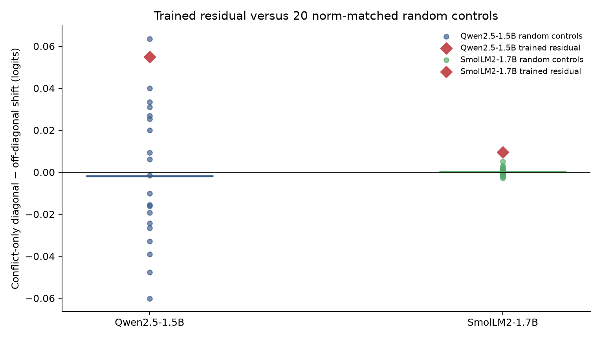

# Layer-16 residual against random controls (experiment 020)

Experiment 020 tests whether the layer-16 learned aspect residual exceeds the distribution of 20 independent, norm-matched random residual controls on the 29 polarity-conflict TripR sentences (all 63 mapped queries). This is a seed-robustness check on the 018/019 benchmark, not an independent dataset replication.

## qwen-1.5b

Baseline strict accuracy on conflict queries: 79.4%.
- Learned residual specificity: +0.054982 logits.
- Random-seed mean: -0.001869 logits; seed range [-0.060111, +0.063592].
- Learned minus random mean: +0.056851 (nested sentence/seed bootstrap 95% CI [+0.018477, +0.098518]).
- One-sided Monte Carlo rank p: 0.0952.

## smollm2-1.7b

Baseline strict accuracy on conflict queries: 58.7%.
- Learned residual specificity: +0.009458 logits.
- Random-seed mean: +0.000262 logits; seed range [-0.002814, +0.005084].
- Learned minus random mean: +0.009196 (nested sentence/seed bootstrap 95% CI [+0.006381, +0.012136]).
- One-sided Monte Carlo rank p: 0.0476.

**Cross-model control-robustness gate:** FAIL.

All 20 control seeds and per-example outcomes are retained in the compressed files. Review text is omitted. Attribution and license are in `DATA_ATTRIBUTION.md`; checks are in `audit.json` and `SHA256SUMS`.
